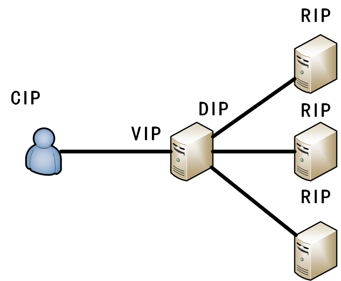
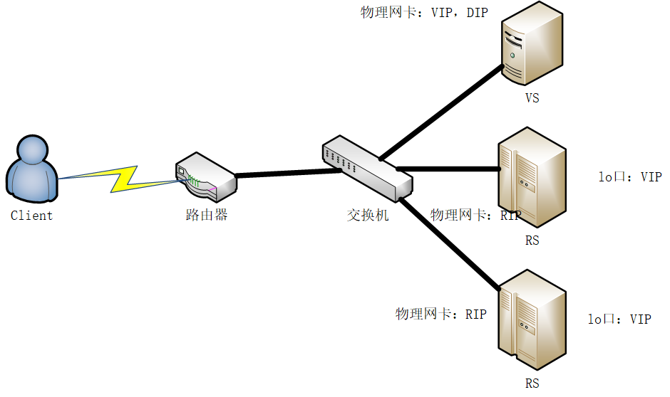
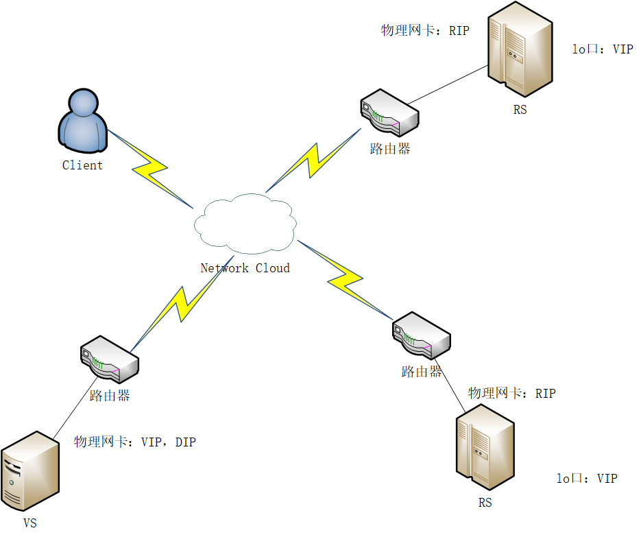
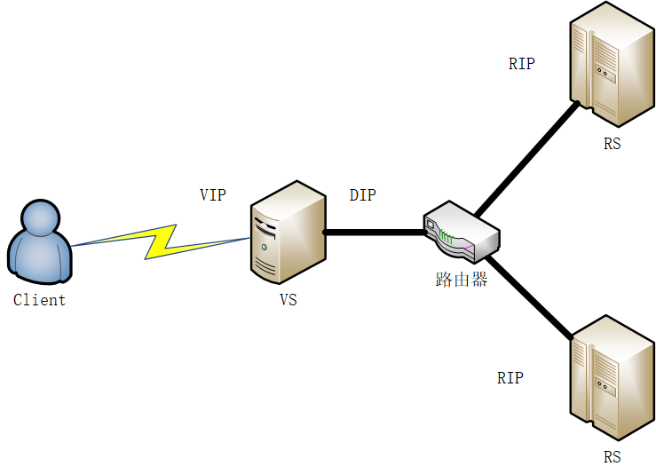
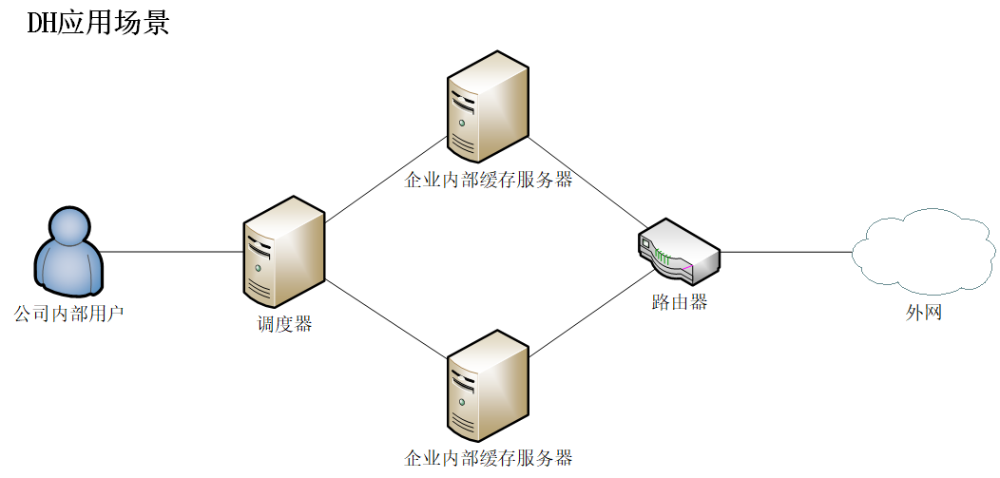
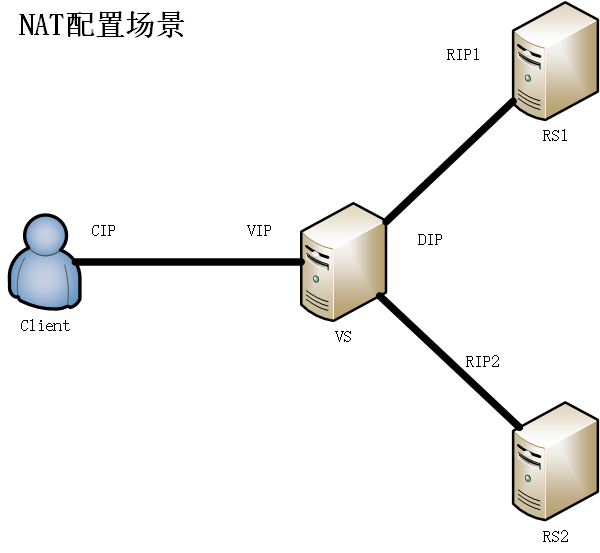
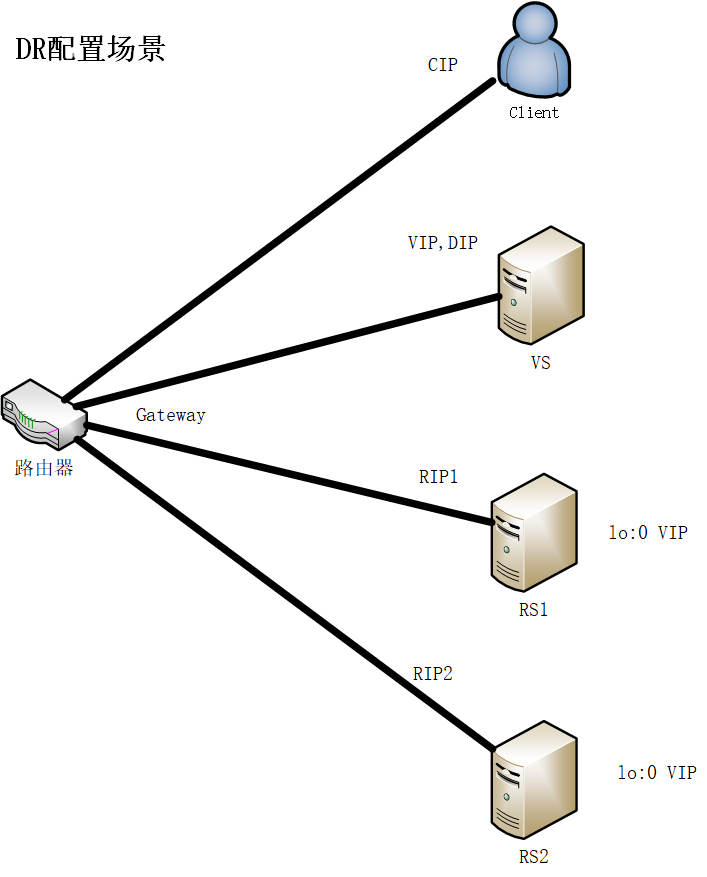

# 0. 引入

LVS（Linux Virtual Server）是一个开源的负载均衡“软件”，不同于用户空间的软件，该项目由章文嵩博士在1998年成立，现已经被集成到的Linux的内核模块当中。LVS的功能就是使用集群技术\*和Linux操作系统实现一个高性能、高可用的服务器。

> 集群：多个计算机集合，为解决某个特定问题组合起来形成的单个系统


# 1. LVS基本介绍

构成LVS的服务器有两种：

1. **VS**：Virtual Server，虚拟服务器。功能是根据请求报文的目标IP和目标协议及端口将其调度至某Real Server。根据调度算法挑选Real Server。
2. **RS**：Real Server，真实服务器。是真正处理请求的服务器

**lvs的“软件”组成部分**：ipvsadm和ipvs

**ipvsadm**：用户空间的命令行工具，规则管理器，用于管理集群服务及相关的RealServer；

**ipvs**：工作于内核空间的netfilter的INPUT钩子之上的框架（所以学习这门技术前，必须先学习iptables）；

要学习LVS，还要先懂得lvs集群类型中的术语：

vs及其别名：Virtual Server, Director, Dispatcher, Balancer

rs及其别名：Real Server, upstream server, backend server

CIP：Client IP,客户端IP

 VIP: Virtual server IP，虚拟服务器IP，一般是用户访问的IP

 RIP: Real server IP, 真实服务器的IP，实际处理请求的服务器

DIP: Director IP，调度服务器的IP，是面向Real Server这一侧的Virtual Server的接口的IP。

**LVS的运行原理**：

LVS运行于netfilter的INPUT钩子上，当报文匹配到INPUT钩子上LVS的项，则会将该报文直接送往POSTROUTING处理。然后在转发给调度到的RS。

# 2. LVS集群类型

lvs的集群类型有以下四种：

- lvs-nat：修改请求报文的目标IP；多目标IP的DNAT；
- lvs-dr：操纵封装新的MAC地址（被算法挑选出的RealServer的MAC地址）;
- lvs-tun：在原请求IP报文之外新加一个IP首部；
- lvs-fullnat：修改请求报文的源和目标IP；（非标准类型）

lvs-fullnat并不属于标准类型，它需要使用者重新编译Linux内核方可以使用，并且获取方法较为复杂，但它的灵活性也是相较其他几个最高的。

接下来会列出各类型所应用的场景，借助场景深刻理解LVS的各个类型是如何运行的。

## 2.1 lvs-nat

**工作原理**：多目标IP的DNAT，通过将请求报文中的目标地址和目标端口修改为某挑出的RS的RIP和PORT实现转发。





（中间那台是VS，右边三台是RS）

一次用户发起请求至得到回复的过程如下：

1. Client向服务器请求资源，源IP地址为CIP，目的IP地址为VIP（公网地址）
2. 调度器挑选出一个Real Server进行相应。选中的Real Server的RIP作为目的地址，源IP地址保持不变。
3. RIP相应用户的请求，源IP为RIP，目标IP为CIP。需要注意此时：用户访问的是VIP，而已RIP作为响应的源IP肯定是不会被用户接受的。
4. 因此响应的报文必须经过Virtual Server（通过设置网关为DIP），让虚拟服务器通过映射表将其源IP改为VIP，目标IP仍然为CIP。修改完成后将响应报文发送给Client。
5. 最后Client会接收到源IP地址为VIP，目的IP地址为CIP的响应报文。

综上，一次请求、响应过程就完成了。

需要注意以下几点：

1. RIP和DIP必须在同一个IP网络，且应该使用私网地址；**RS的网关要指向DIP**；
2. 请求报文和响应报文都必须经由Director转发；（也因此Director易于成为系统瓶颈）；
3. 该LVS类型支持端口映射，可修改请求报文的目标PORT；
4. vs必须是Linux系统，rs可以是任意系统。


**分析**：该类型的缺点就在于响应报文必须经过VS转发出去，而响应报文通常要比客户的请求报文大上千倍。所以VS的性能必然会成为瓶颈。而解决这个问题的关键就是不让响应报文流经VS再转发出去。由此引出我们第二个类型的使用场景。


## 2.2 lvs-dr

**工作原理**：通过为请求报文重新封装一个MAC首部进行转发，源MAC是DIP所在的接口的MAC，目标MAC是某挑选出的RS的RIP所在接口的MAC地址；源IP/PORT，以及目标IP/PORT均保持不变。



首先讲**配置原理**：

配置时RS的环回口和VS的物理网卡都必须同时配置VIP，并且以上路由器的ARP映射表中，VIP对应的MAC地址必须是VS的VIP的物理网卡的MAC地址。

那么如何实现路由器的ARP映射表中VIP对应的MAC地址肯定是VIP的物理网卡的MAC地址呢？

有两种办法：第一种就是MAC地址绑定，通过手动指定ARP表项实现；第二种是关闭所有RS的lo口的ARP响应和通告功能，使得路由器发起ARP请求的时候，仅有VS会响应。

第一种办法其实并不实用，因为如果出现VS有两台的情况下，则会使得MAC地址绑定失效。

第二种方法才是主流的方法，而如何关闭ARP的响应功能的方法也有两种：第一种就是通过arptables（可以实现二层的过滤功能）或者nftables（nftables=iptables+arptables）进行流量过滤；第二种就是通过调整RS的内核参数，关闭ARP的通告和应答。

然后在说明一下RS的响应问题：需要注意一点：对于Linux而言有个特点，响应报文先经由一个接口，则会将那个接口的IP地址作为发送报文的源地址。也就是说在没有配置lo口的别名为VIP的情况下，RS的响应报文会以RIP为源IP，而客户端访问的并非RIP，所以不会接受这个响应报文。也就是说，要实现这个场景，必须在RS的lo口的别名上配置VIP。

接下来就具体讲讲用户的一次请求到得到回复的**过程**：

1. 首先由Client发起请求，其.中源IP为CIP，目标IP为VIP（因此VIP必须是公网IP）
2. 由于之前的配置，最终VS会得到这个报文。VS通过分析后，知道这个是需要调度的报文。此时，将在请求报文的最外层再封装一个MAC地址首部，其中源MAC地址为自己DIP的MAC地址，目标MAC地址为RIP的MAC地址。然后发送给调度中的RS
3. RS接收到该报文后，将响应该报文，响应报文将会由自己的环回口发出，源IP为VIP，目标IP为CIP，该响应报文会先经过自己的物理网卡，再发送给Client。
4. 最后Client会接收到源IP地址为VIP，目的IP地址为CIP的响应报文。

DR的配置需要**注意**以下几点：

1. 确保前端路由器将目标IP为VIP的请求报文发往Director
2. RS的RIP可以使用私网地址，也可以是公网地址；RIP与DIP在同一IP网络；RIP的网关不能指向DIP，以确保响应报文不会经由Director
3. RS跟Director要在同一个物理网络
4. 请求报文要经由Director，但响应不能经由Director，而是由RS直接发往Client
5. 不支持端口映射

**分析**：以上两种类型都RS和VS一般都部署在一个局域网内，无法跨广域网部署，也就是说无法做灾难备份。因此，引出下面的lvs\-tun类型，它是一个克服了以上缺点的类型。

## 2.3 lvs-tun

**工作原理**：不修改请求报文的IP首部（源IP为CIP，目标IP为VIP），而是在原IP报文之外再封装一个IP首部（源IP是DIP，目标IP是RIP），将报文发往挑选出的目标RS；RS直接响应给客户端（源IP是VIP，目标IP是CIP）



了解该类型需要事先知道以下两个点：

- DIP，RIP和VIP必须是公网地址。
- 也同DR类型一样，需要在RS的环回口上配置VIP，然而同DR不一样的是：RS无需再禁用ARP通告和应答。因为RS环回口上配置的VIP必然与自己RIP（物理接口）所在的网段不同（因为公网地址不能重复），也就是说从客户端发起的请求根本无法进入RS所在的网段，而只会发往VS所在的网段。

接下来将客户发起一次请求至接收到回复的**过程**：

1. Client发起请求，源地址为CIP，目标IP为VIP。
2. VS接收到请求，并在INPUT钩子上发现该报文是关于LVS的报文，则将在该报文前面再加上一个IP首部，源地址为DIP，目的地址为RIP。然后通过公网发送给RS。
3. RS接收到该报文后会进行解封装，解封装发现第一层IP首部的目的地址是自己。第二层IP首部的目的地址还是自己的环回口（VIP），RS会因此产生并发送直接响应客户端CIP的报文。（这里的两次IP首部，需要RS的OS支持隧道功能）
4. 最后Client会接收到源IP地址为VIP，目的IP地址为CIP的响应报文。

使用该类型应该**注意**的点：

1. DIP, VIP, RIP都应该是公网地址；
2. RS的网关不能，也不可能指向DIP
3. 请求报文要经由Director，但响应不能经由Director
4. 不支持端口映射
5. RS的OS得支持隧道功能

**分析**：VS封装两层IP首部的时候可能会超过MTU的限制，不过客户端的请求报文相对来说都很小，这个问题可以忽略不计。这个方法可以解决跨广域网的灾难备份问题。但是针对于下面这个场景却显得有些臃肿：一个公司（局域网）中，RS和RS，RS和VS都不在同一个网段内（被路由器分隔了）。也有上面这个场景，我们引出LVS的最后一个类型------lvs-fullnat。

## 2.4 lvs-fullnat

**工作原理**：通过同时修改请求报文的源IP地址和目标IP地址进行转发。



以上就是lvs-fullnat的适用场景，可以直接通过客户的一次请求理解这个类型的工作：

1. Client发起请求，目标IP地址为VIP，源IP地址为CIP。
2. VS接收到该请求报文，并在INPUT钩子上发现这是关于LVS的请求报文，因此通过调度选出某一个RS做响应。修改原请求报文的源IP地址为DIP，目标IP地址为选出的RIP。
3. RS接收到请求报文后，封装响应报文时，源IP地址为RIP，目标IP地址为DIP。该报文会被发送给VS。
4. VS接收到响应报文后，查询本地的映射表，将其目标IP地址改为CIP，源地址改为VIP。然后再发送给Client。
5. 最后Client会接收到源IP地址为VIP，目的IP地址为CIP的响应报文。


配置该类型需要**注意**的点：

1. VIP是公网地址，RIP和DIP是私网地址，且通常不在同一IP网络；因此，RIP的网关一般不会指向DIP。
2. RS收到的请求报文源地址是DIP，因此，只能响应给DIP；但Director还要将其发往Client。
3. 请求和响应报文都经由Director。
4. 支持端口映射。


**总结**：该类型的最大问题还是和nat一样：Director可能会成为瓶颈。并且该类型并非标准类型，需要打补丁并重新编译后才能使用，或者使用某些工具实现。

------

**LVS集群类型总结**：

```
lvs-nat, lvs-fullnat：请求和响应报文都经由Director；
	lvs-nat：RIP的网关要指向DIP；
	lvs-fullnat：RIP和DIP未必在同一IP网络，但要能通信；
lvs-dr, lvs-tun：请求报文要经由Director，但响应报文由RS直接发往Client；
	lvs-dr：通过封装新的MAC首部实现，通过MAC网络转发；
	lvs-tun：通过在原IP报文之外封装新的IP首部实现转发，支持远距离通信；
```

# 3. LVS调度方法

根据是否考虑RS的负载状态，可以将LVS调度方法分为两类：静态方法和动态方法。

接下来就会分别介绍两种方法的具体算法及其适用场景。

## 3.1 静态方法

静态方法仅根据算法本身进行调度，不会考虑RS的负载状态。这种方法比较适合短连接。

其中**静态方法**的算法又有以下4种：

```
RR：roundrobin，轮询；也就是按顺序对每个RS发放请求。
WRR：Weighted RR，加权轮询。通过权重按顺序对每个RS发放请求。例如：第一个RS处理能力好，配置权重5，第二个RS处理能力差，配置权重1，然后Director会先给第一个RS发放5个请求，然后给第二个RS发放1个请求，以此循环。
SH：Source Hashing，实现session sticky，源IP地址hash；将来自于同一个IP地址的请求始终发往第一次挑中的RS，从而实现会话绑定（这里的会话，指的是客户发起请求后在服务端留下的缓存）
DH：Destination Hashing；目标地址哈希，将发往同一个目标地址的请求始终转发至第一次挑中的RS（挑选会使用WRR算法），典型使用场景是正向代理缓存场景中的负载均衡；
```

关于DH的应用场景我还是想描述的清楚一些，首先查看DH的应用场景如下：



此时企业内部缓存服务器为RS。

调度器此时在企业内部，他为公司内部用户提供服务，当用户访问外网时，会留缓存在两个缓存服务器上。那么多个用户访问同一个网页就会应用DH方法，使得用户访问的是同一个企业内部缓存服务器。

因此，DH算法可以提高该场景的缓存命中率。

## 3.2 动态方法

动态方法根据RS的负载状态及调度算法进行调度。这种方法比较适合长连接。

研究动态方法需要知晓三个参数：

Overhead：该参数就是用来作为衡量RS负载状态的指标的。

activeconns：保持连接中，活跃的连接数量

inactiveconns：保持连接中，不活跃的连接数量

一般而言，活跃的连接占用的资源是不活跃连接的256倍。也因此，以下算法中SED将inactiveconns占用的资源忽略不计。

动态方法有以下6种：

```
LC:least connection，其中Overhead=activeconns*256+inactiveconns。也就是说将任务分配给Overhead最小的RS。
WLC：Weighted least connection，其中Overhead=(activeconns*256+inactiveconns)/weight。相对于LC而言，WLC分配了权重。
SED：Shortest Expection Delay，其中Overhead=(activeconns+1)*256/weight。这是WLC的改进版，由于WLC在还没开始分配请求的时候，所有的RS的activeconns和inactiveconns都为0，也就导致Overhead为0，这就有可能导致一段时间内请求数少的时候，出现只有性能较差的那个被调度选中。
NQ：Never Queue，只要有空闲的，则无论权重，空闲的必须被分配任务。这是用来弥补SED的缺陷的。因为SED也可能会因为一段时间内请求数少的时候，出现只有性能最好的那个被调度选中。
LBLC：Locality-Based LC，动态的DH算法；找负载较轻的。
LBLCR：LBLC with Replication，带复制功能的LBLC，可以实现缓存复制。先注意上述的LBLC的HASH表最终会定型，然后假设有以下这么一个场景，有两台RS，两台RS的HASH表都已经定型了，而RS1的客户活跃度相对于RS2的客户活跃度高出很多，也因此RS1到最后还是吃不消，此时就需要RS2帮忙，而RS2的帮忙需要RS1的缓存，此时就需要使用LBLCR方法实现缓存复制。
```

# 4. ipvsadm命令使用

前面介绍过ipvsadm是用户空间的工具，用来修改内核中ipvs的规则。

接下来将介绍ipvsadm的**基本使用方法**：

**添加一条集群服务**：

```shell
ipvsadm -A|E -t|u|f service-address [-s scheduler] [-p [timeout]]

-A：添加集群服务，
-E：修改集群服务
-t：指定为tcp协议的端口
-u：指定为udp协议的端口
-f：指定使用防火墙标记来区分该集群服务，使用该参数时，后面所跟不再是service-address，而是防火墙标记
service-address：IP地址加端口号或是一个防火墙标记
-s scheduler：指定调度方法
-p：持久连接。无论使用什么调度方法，都可以实现：在一定时间内，将来自同一个地址的请求始终发往同一个RS。后面的timeout表示这段时间的长度，不指定的话，默认为360s
```

>提示：每个集群服务使用“IP地址和端口以及协议类型”或“防火墙标记”来区分。

**示例**：

添加一条集群服务，用来转发访问192.168.10.10：80的tcp协议请求，使用sed调度方法，并指定持久连接，持久连接时间使用默认值。（注意：本地必须有一个配置该IP地址的接口）

```shell
ipvsadm -A -t 192.168.10.10:80 -s sed -p
```


**删除一条集群服务**：

```shell
ipvsadm -D -t|u|f service-address

-D：删除一条集群服务
其它选项同上。
```

**示例**：

将刚刚示例中添加的那一条集群服务删除。

```shell
ipvsadm -D -t 192.168.10.10:80
```


**清空所有的集群服务**：

```shell
ipvsadm -C

-C：清空所有的集群服务
```


**向集群服务中添加RS**：

```shell
ipvsadm -a|e -t|u|f service-address -r server-address [options]

-a：向集群服务中添加RS
-e：修改集群服务中RS的options
-r：指定rs的IP地址及端口。若集群类型是nat和fullnat，端口号可有可无，无代表不开启端口映射。但对于dr和tun这两个不支持端口映射的集群类型是不能加上端口号的。

options：
	-w weight：若调度方法不为RR或LC，则使用该选项指定权重
	-g：（gateway）指定集群类型为dr，默认的集群类型
	-m：（masquerade）指定集群类型为nat
	-i：（ipip）指定集群类型为tun

其它选项同上。
```

**示例**：

向tcp，192.168.10.10:80的集群服务添加一个rs（192.168.10.20)。并将其端口映射到8080端口，并指定权重为5。

```shell
ipvsadm -a -t 192.168.10.10:80 -r 192.168.10.20:8080 -m -w 5
```


**向集群服务中删除RS**：

```shell
ipvsadm -d -t|u|f service-address -r server-address

-d：集群服务中删除RS。
```

**示例**：

将刚才加入的rs移除。

```shell
ipvsadm -d -t 192.168.10.10:80 -r 192.168.10.20:8080
```


**查看集群服务**：

```shell
ipvsadm -L|l [options]

-L|l：查看集群服务
options：
	-n：取消反解
	--stats：输出统计信息
	--connection：输出当前的活动连接和非活动连接
	--rate：速率数据。类似于一天内接受的请求数量/一天的时间（单位为秒）
```


**计数器清零**：

```shell
ipvsadm -Z [-t|u|f service-address]

-Z：计数器清零
-t|u|f service-address：指定清零某一项集群服务；若不指定，则清零所有的集群服务
```


**配置保存**：不保存的话重启就会被清空

```shell
ipvsadm -S [-n]

-S：配置保存
-n：取消反解，尽量取消，因为反解会消耗性能

使用方法：ipvsadm -S -n > FILEPATH

ipvsadm -S可以使用ipvsadm-save替代
```

>提示：ipvsadm也有unit文件，不过他不是一项服务，它的unit文件是为了保存和读取配置。而读取或保存的配置文件就是/etc/sysconfig/ipvsadm-config。

**示例**：

将当前的配置保存至/etc/sysconfig/ipvsadm，取消反解

```shell
ipvsadm -S -n > /etc/sysconfig/ipvsadm-config
或
ipvsadm-save -n > /etc/sysconfig/ipvsadm-config
```


**配置读取**：

```shell
ipvsadm -R

-R：读取配置

使用方法：ipvsadm -R < /etc/sysconfig/ipvsadm-config
ipvsadm -R可以使用ipvsadm-restore
```

**示例**：

读取/etc/sysconfig/ipvsadm的配置

```shell
ipvsadm -R < /etc/sysconfig/ipvsadm-config
或
ipvsadm-restore < /etc/sysconfig/ipvsadm-config
```

# 5. ipvs集群配置

以下讲解nat和dr的集群配置。

## 5.1 NAT配置



本次配置采用虚拟机配置，VS必须有两个网卡，一个配置桥接，负责和Client相连，一个配置仅主机，负责和RS相连。Client端是布置虚拟机的真机。

其中各个IP地址：

````
CIP：192.168.3.3 255.255.255.0
VIP：192.168.3.99 255.255.255.0
DIP：192.168.10.254 255.255.255.0
RIP1:192.168.10.10 255.255.255.0 GW：192.168.10.254
RIP2:192.168.10.20 255.255.255.0 GW：192.168.10.254
````

首先在调度器上安装ipvsadm：

```shell
[root@vs ~]# yum install ipvsadm -y
```

两个rs上安装httpd软件，用来做测试：

```shell
[root@rs1 ~]# yum install httpd -y
```

```shell
[root@rs2 ~]# yum install httpd -y
```

部署测试环境：

```shell
[root@rs1 ~]# echo "RS1" > /var/www/html/index.html
[root@rs1 ~]# systemctl start httpd
```

```shell
[root@rs2 ~]# echo "RS2" > /var/www/html/index.html
[root@rs2 ~]# systemctl start httpd
```

配置调度器的ipvs，实现负载均衡：

```shell
[root@vs ~]# ipvsadm -A -t 192.168.3.99:80 -s wrr 
[root@vs ~]# ipvsadm -a -t 192.168.3.99:80 -r 192.168.10.10 -w 3 -m
[root@vs ~]# ipvsadm -a -t 192.168.3.99:80 -r 192.168.10.20 -w 2 -m
[root@vs ~]# ipvsadm -Ln
IP Virtual Server version 1.2.1 (size=4096)
Prot LocalAddress:Port Scheduler Flags
  -> RemoteAddress:Port           Forward Weight ActiveConn InActConn
TCP  192.168.3.99:80 wrr
  -> 192.168.10.10:80             Route   3      0          0         
  -> 192.168.10.20:80             Route   2      0          0       
```

开启调度器的核心转发功能：

```shell
[root@vs ~]# sysctl -w net.ipv4.ip_forward=1
net.ipv4.ip_forward = 1
```

使用真机浏览多次192.168.3.99的网页，在查看调度结果：

```shell
[root@vs ~]# ipvsadm -Ln --connection
IPVS connection entries
pro expire state       source             virtual            destination
TCP 00:28  TIME_WAIT   192.168.3.3:58969  192.168.3.99:80    192.168.10.20:80
TCP 01:58  TIME_WAIT   192.168.3.3:59210  192.168.3.99:80    192.168.10.20:80
TCP 01:08  TIME_WAIT   192.168.3.3:59078  192.168.3.99:80    192.168.10.10:80
TCP 01:31  TIME_WAIT   192.168.3.3:59160  192.168.3.99:80    192.168.10.10:80
TCP 00:05  TIME_WAIT   192.168.3.3:58942  192.168.3.99:80    192.168.10.10:80
TCP 00:14  TIME_WAIT   192.168.3.3:58941  192.168.3.99:80    192.168.10.20:80
TCP 01:31  TIME_WAIT   192.168.3.3:59161  192.168.3.99:80    192.168.10.10:80
TCP 00:08  CLOSE       192.168.3.3:59211  192.168.3.99:80    192.168.10.10:80
TCP 01:08  TIME_WAIT   192.168.3.3:59080  192.168.3.99:80    192.168.10.20:80
TCP 00:23  TIME_WAIT   192.168.3.3:58966  192.168.3.99:80    192.168.10.10:80
```

最后一排destination证明我们的权重配置生效了。

>有些浏览器的缓存功能使得负载均衡的效果并不明显


## 5.2 DR配置



VS、RS1、RS2都采用桥接模式和主机连接在同一个路由器上。

各个IP地址：

```
CIP：192.168.3.3
VIP：192.168.3.99
DIP：192.168.3.88
RIP1：192.168.3.111
RIP2:192.168.3.222
Gateway:192.168.3.1
```

关闭RS1和RS2的ARP宣告和ARP应答。

```shell
[root@rs1 ~]# echo 1 > /proc/sys/net/ipv4/conf/all/arp_ignore 
[root@rs1 ~]# echo 1 > /proc/sys/net/ipv4/conf/lo/arp_ignore 
[root@rs1 ~]# echo 2 > /proc/sys/net/ipv4/conf/all/arp_announce 
[root@rs1 ~]# echo 2 > /proc/sys/net/ipv4/conf/lo/arp_announce 
```

```shell
[root@rs2 ~]# echo 1 > /proc/sys/net/ipv4/conf/all/arp_ignore 
[root@rs2 ~]# echo 1 > /proc/sys/net/ipv4/conf/lo/arp_ignore 
[root@rs2 ~]# echo 2 > /proc/sys/net/ipv4/conf/all/arp_announce
[root@rs2 ~]# echo 2 > /proc/sys/net/ipv4/conf/lo/arp_announce
```

配置RS上的环回口IP地址及路由：

```shell
[root@rs1 ~]# ifconfig lo:0 192.168.3.99 netmask 255.255.255.255 broadcast 192.168.3.99
[root@rs1 ~]# route add -host 192.168.3.99 dev lo:0
```

```shell
[root@rs2 ~]# ifconfig lo:0 192.168.3.99 netmask 255.255.255.255 broadcast 192.168.3.99
[root@rs2 ~]# route add -host 192.168.3.99 dev lo:0
```

配置VS上的接口别名为VIP：

```shell
[root@vs ~]# ifconfig ens32:0 192.168.3.99 netmask 255.255.255.255 broadcast 192.168.3.99
```

开启VS上的核心转发功能：

```shell
[root@vs ~]# sysctl -w net.ipv4.ip_forward=1
net.ipv4.ip_forward = 1
```

RS上部署测试环境。

部署测试环境：

```shell
[root@rs1 ~]# yum install httpd -y
```

```shell
[root@rs2 ~]# yum install httpd -y
```

```shell
[root@rs1 ~]# echo "RS1" > /var/www/html/index.html
[root@rs1 ~]# systemctl start httpd
```

```shell
[root@rs2 ~]# echo "RS2" > /var/www/html/index.html
[root@rs2 ~]# systemctl start httpd
```

调度器安装ipvsadm。

```shell
[root@vs ~]# yum install ipvsadm -y
```

配置ipvs：

```shell
[root@vs ~]# ipvsadm -A -t 192.168.3.99:80 -s wrr
[root@vs ~]# ivpsadm -a -t 192.168.3.99:80 -r 192.168.3.111 -w 3
[root@vs ~]# ipvsadm -a -t 192.168.3.99:80 -r 192.168.3.222 -w 2
```

多次访问192.168.3.99这个网页，查看负载均衡结果：

```shell
[root@vs ~]# ipvsadm -Ln --connection
IPVS connection entries
pro expire state       source             virtual            destination
TCP 14:34  ESTABLISHED 192.168.3.3:63097  192.168.3.99:80    192.168.3.222:80
TCP 01:45  FIN_WAIT    192.168.3.3:63093  192.168.3.99:80    192.168.3.111:80
TCP 01:26  FIN_WAIT    192.168.3.3:63031  192.168.3.99:80    192.168.3.111:80
TCP 14:58  ESTABLISHED 192.168.3.3:63156  192.168.3.99:80    192.168.3.111:80
TCP 00:30  FIN_WAIT    192.168.3.3:62901  192.168.3.99:80    192.168.3.222:80
TCP 14:52  ESTABLISHED 192.168.3.3:63157  192.168.3.99:80    192.168.3.222:80
```

> 有些浏览器的缓存功能使得负载均衡的效果并不明显

