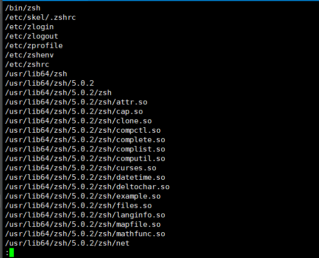
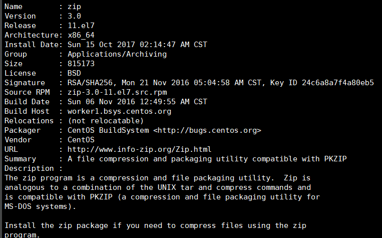
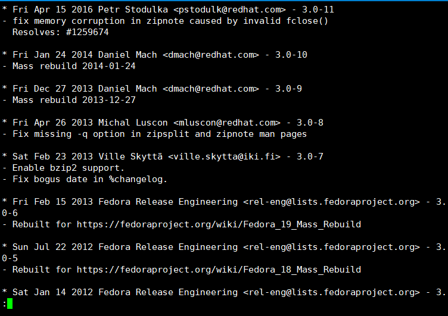
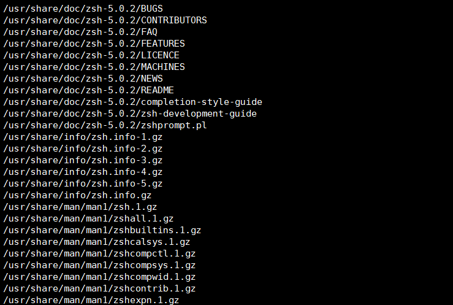
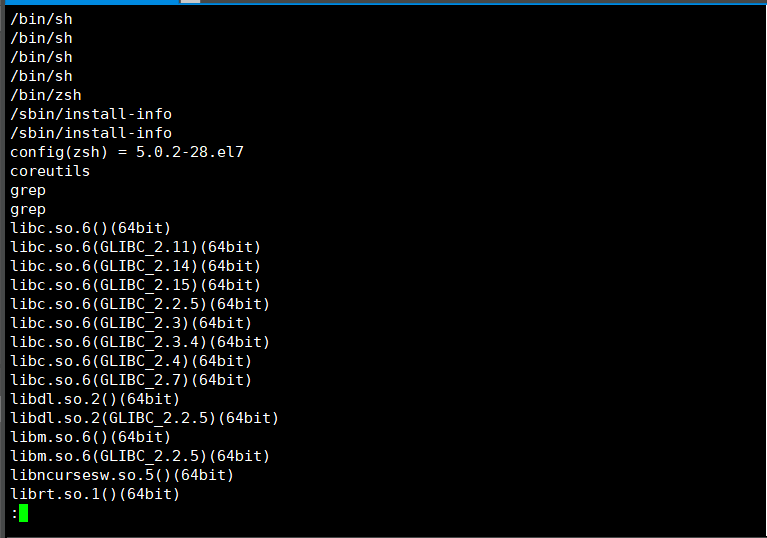
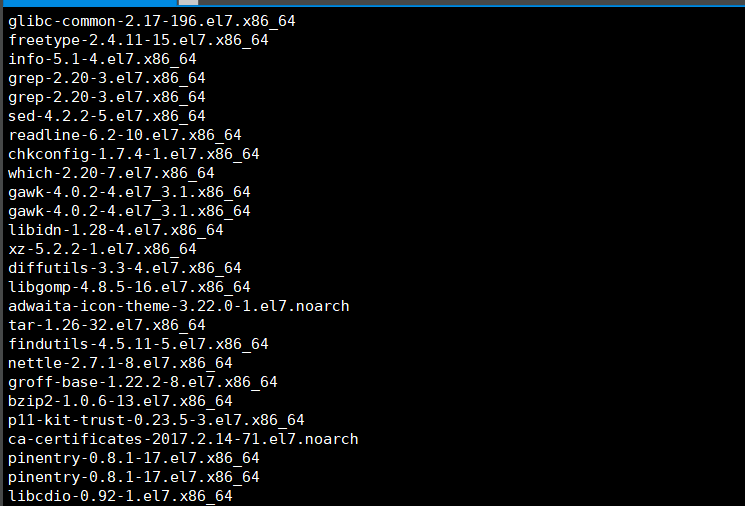
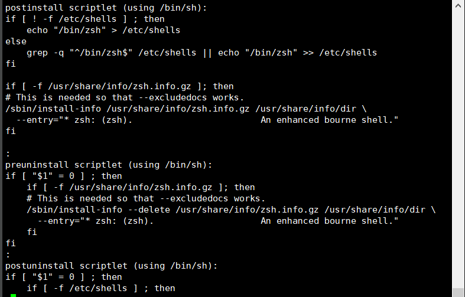
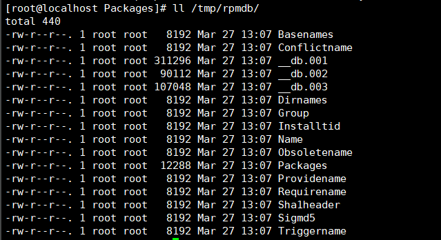

[TOC]

# 1.  RPM程序包管理工具的概念

## 1.1  程序包管理工具的由来

​	程序是由程序员开发而来的，程序员需要编写源代码并将其执行编译、链接等操作来得到计算机可以读懂且运行的二进制代码程序。需要注意的是源代码编译时需要用到对应的编译器，而链接则需要对应的链接文件，因此，我们可以明白在一个系统上，想通过源代码的形式来安装程序需要提前部署好计算机的环境，否则编译等操作将无法完成。

​	不过，Linux系统上的二进制程序可以复制传输给其它的计算机系统上，这样就可以省去很多编译的时间，但前提是两个Linux系统的的发行版版本和内核版本都必须一模一样，否则同一个程序在不同的运行环境上是运行不起来的。但在绝大多数情况下，两个Linux系统的发行版本和内核版本都是不同的，所以在以前程序的安装需要经过长时间的编译和后续的各种操作才能完成。而早期没有包管理工具的Linux注定是不会被不擅长编程的人所接受，而对于会编程的人，面对每次安装程序的繁琐操作也会感到无比头疼。

​	为了解决上述的问题，Linux很多发行版都开发出了各种各样的程序包管理工具，其中最有名的就是Debian的dpkg工具和RedHat的rpm工具。以下一个表格给出了各个发行版代表所提供的软件管理机制及线上升级机制(线上升级机制的概念在1.2.2的注释中给出了)

| 发行版代表    | 软件管理机制 | 使用命令     | 线上升级机制(命令) |
| ------------- | ------------ | ------------ | ------------------ |
| RedHat/Fedora | RPM          | rpm,rpmbuild | YUM(yum)           |
| Debian/Ubuntu | DPKG         | dpkg         | APT(apt-get)       |

> 以上两个发行版各自的再发行版都继承了其包管理机制及线上升级机制，但fedora是一个例外，它是RedHat的再发行版，然而其使用的线上升级机制是dnf，是一个比YUM更加好用的线上升级机制。还需要注意的是，SUSE也使用RPM软件管理机制，但是其rpm包与RedHat的rpm包并不是相互兼容的，也就是说SUSE的rpm包不能在RedHat上正常安装，反之亦然。

## 1.2  RPM程序包的概念介绍

### 1.2.1  程序包的基本功能	

​	程序包管理工具的**基本功能**就是将需要在某平台安装或升级的软件提前编译好，然后将这个编译好的软件的所有相关文件打包成为一个特殊格式的文件，打包的特殊文件中还中加入了预先侦测系统与软件依赖关系的脚本、软件所提供的所有文件资讯等。


### 1.2.2  什么是软件依赖关系？

​	一般情况下，Linux中的每个程序完成单一而简单的任务，若需要完成复杂的任务则需要多个程序一起组合完成，因此一个程序的运行往往需要系统运行多个其他程序，这就产生了软件依赖关系。在安装一个软件时，一般需要将其依赖的软件提前安装。软件的依赖关系会引起软件无法完成安装，想要解决这个问题就需要提前安装好所依赖的软件，但有时候你想安装的软件的依赖软件也有自己的依赖软件，所以有时候安装一个软件就会遇到子子孙孙无穷尽也的问题。而软件依赖关系指的就是**软件在安装或运行时相互需求的关系**。

> ​	由于依赖关系也是个令人头疼的问题，所以后来有些Linux发行版又开发出新的能解决依赖关系问题的线上升级机制，通过这种机制可以自动解决软件的依赖关系，使得安装软件变的十分容易。


### 1.2.3  RPM包的命名格式详解

接下来使用一个rpm包做例子来讲解RPM包的命名格式。

以vsftpd-3.0.2-22.el7.x86_64.rpm做例子，以下介绍各个组成部分

1. 名称：vsftpd
2. 版本号：指的是软件版本号。其中"3"代表主版本号，象征着软件的重大分支；"0.2"代表的是次版本号，当每加入新的功能或修改原来的功能时，次版本号发生改变。
3. 软件的编译次数：指的是软件的编译次数，重复编译的目的是为了修复程序的bug。
4. 绝对适合安装的操作系统：“el7”指的是rhel7操作系统，并不是所有的rpm包名称都有这部分，如果有则代表该软件包绝对能够安装在某个操作系统上。
5. 适合的硬件平台：“x86_64”指的是该rpm包适用于x86_64的硬件平台。其他的硬件平台有i386,i586,i686。还有一种比较特殊的是noarch，表示该rpm包可以在任何硬件平台上安装。

> 目前新的CPU都可以运行旧的CPU所支持的软件，也就是说硬件方面都可以向下兼容。不过，想要让软件有最出色的效率，还是选择搭配你的硬件的RPM文件吧，因为标注不同硬件平台的软件一般都会针对CPU硬件平台进行优化。


### 1.2.4  RPM的优点归纳

1. **RPM的包不需要编译便可以安装**。因为RPM包中包含的数据都是已经编译过的程序和配置档等等。
2. **可以避免安装错误**。RPM包会在安装前检查操作系统的版本和剩余的硬盘容量等信息。
3. **RPM文件中包含了各种各样的信息，方便用户对软件的了解**。其中的信息包括有：软件版本信息，依赖的软件名称，软件的用途说明，软件所包含的文件。
4. **RPM使用数据库来管理程序包的安装、升级、卸载与验证**。数据库记录了RPM文件的相关参数。


### 1.2.5  RPM包的内容归纳

1. 软件预先编译、链接等操作完成后得到的内容，在安装时会得到该信息。

2. 软件的参考信息，提供给用户参考用。可以使用下面的命令得到该信息

   ```bash
   rpm -qi	PACKAGENAME		//查看已安装软件的参考信息
   rpm -qpi PACKAGENAME 	//查看未安装的软件的参考信息
   
   # 查看未安装的软件的相关信息一般都需要在之前加入-p参数，以下不在介绍
   ```

3. 软件安装后会生成的文件的列表

   ```bash
   rpm -ql PACKAGENAME		
   rpm -qpl PACKAGENAME 
   ```

4. 软件的依赖关系

   ```bash
   rpm -q --requires zsh-5.0.2-28.el7.x86_64.rpm
   rpm -qp --requires zsh-5.0.2-28.el7.x86_64.rpm
   ```

除了上述比较重要的信息，rpm包还包括更新日志，帮助文件，配置文件列表等等信息，在后面的包管理指令归纳中会一一给出。


# 2  RPM包管理命令

rpm包管理的命令分为五大类，分别是安装、升级、卸载、查询、校验。

接下来的示例中的rpm包都在光盘源的Package中。

## 2.1  安装

### 2.1.1  使用方法

```bash
指令格式：rpm {-i|--install} [install-options] PACKAGE_FILE

选项：
	-h,--hash:		安装时显示安装进度条
	-v,--verbose:	显示详细的安装信息
    -vv:			显示更加详细的安装信息
    -vvv:			显示更加、更加详细的安装信息
    --test:			仅仅作测试，并不是真正的安装
    --nodeps:		安装rpm包时，忽略软件依赖关系
    --replacepkgs:	将原先安装好的软件重新覆盖安装一遍，但不会替换原来的配置文件
    --force:		强制安装
    --nosignature:	不检查包的签名和来源合法性
    --nodigist:		不检查包的完整性
    
# 安装rpm包较常使用的选项组合是-ivh。
```

> 需要注意的是，在程序安装后，程序包的配置文件遭到修改的话，此配置文件在软件修改后会得到保留，并且会重命名为原先的名称加上后缀.rpmsave。所以使用以上安装参数中的--replacepkgs参数，在重装后也不会将原先的配置文件替换。

### 2.1.2  示例

注意：yum在使用时不需要指出文件的完整路径，而在使用rpm安装命令时，需要指出rpm包的完整路径。


使用rpm安装zsh。

```bash
rpm -ivh zsh-5.0.2-28.el7.x86_64.rpm 
```


使用rpm安装zsh时显示更加详细的信息。

```bash
rpm -ivvh zsh-5.0.2-28.el7.x86_64.rpm 
```


## 2.2  卸载

### 2.2.1  使用方法

```bash
指令格式：rpm {-e|--erase} [erase-options] PACKAGE_NAME

选项：
	-h,--hash:		显示安装进度条
	-v,--verbose:	显示详细信息
	-vv:			显示更加详细的信息
	-vvv:			显示更加、更加详细的信息
	--nodeps:		忽略依赖关系而卸载。(若有x依赖于y，则y不能被卸载)
	--test:			测试卸载
	--allmatches:	如果一个软件名称匹配到了多个版本不同的同一软件，则将匹配到的软件全部卸载

# 卸载软件时，常用的选项组合为-evh
```

### 2.2.2  示例

将刚才安装的zsh卸载

```bash
rpm -evh zsh
```


> 注意：卸载时，工作目录不需要是rpm包所在的目录，因为卸载是查找的是rpm数据库，并且只需给出软件的名称即可，不需要使用rpm包的名称。你可以仔细观察安装和卸载时，所跟的参数。

## 2.3  更新

### 2.3.1  使用方法

```bash
指令格式：rpm {-U|--upgrade} [install-options] PACKAGE_FILE
		rpm {-F|--freshen} [install-options] PACKAGE_FILE
#-U和-F的区别就是-U为安装或升级，-F为仅升级

选项：
	-v:				显示详细的信息
	-vv:			显示更详细的信息
	-vvv:			显示更详细、更详细的信息
	--test:			仅测试更新，并不真正更新
	--nodeps:		忽略依赖关系而更新
	--oldpackage:	降级为较老的版本
```

### 2.3.2  示例

```
rpm -Uvh zsh-5.0.2-28.el7.x86_64.rpm
```


> 正常情况下，一个光盘源是不会有一个软件的两个版本的，因此想要模拟更新的话，可以去[rpmfind.net]()，[rpm.pbone.net]()以及想要更新的软件的官网下载最新的rpm包。


## 2.4  查询

### 2.4.1  使用方法

```bash
使用格式：
	rpm {-q|--query} [select-options] [query-options]

不添加select-option和query-option的话,使用rpm -q PACKAGE_NAME会查询某些包是否安装

[select-option]：
	-p:		显示未安装的程序包，需要配合query-option一起使用,但query-option原先所跟的				PACKAGEN_NAME需要改为PACKAGE_FILE。具体应用查看后面的示例
	
	-a PACKAGE_NAME:	若不跟参数则列出所有已安装的包，若跟参数则搜索参数对应的包名称
	-f FILE_PATH:		查找某个文件是由哪个rpm包生成的

[query-options]:
	-i PACKAGE_NAME:	查看某软件的详细信息
	-l PACKAGE_NAME:	列出软件安装时生成的文件列表
    -c PACKAGE_NAME:	列出软件安装时生成的配置文件列表
    -d PACKAGE_NAME:	列出软件安装时生成的帮助文档
    --changelog PACKAGE_NAME:		查看软件的更新日志
    --provides PACKAGE_NAME:		查看某个软件所提供的CAPABALITY，这些CPABILITY通常会被										依赖
    --requires PACKAGE_NAME:		查看某个软件所依赖的CAPABILITY
    --whatprovides CAPABALITY:		查看哪个软件提供指定的CAPABILITY
    --whatrequire CAPABALITY:		查看指定的CAPABILITY被哪个软件所依赖
    --scripts PACKAGE_NAME:			查看某个包安装、卸载时会启用的的脚本
```

```
软件安装和卸载时所用到的脚本有四类：
	1.preinstall：该脚本在软件安装前会执行
	2.postinstall：该脚本会在软件安装后执行
	3.preuninstall：该脚本会在软件卸载前执行
	4.postuninstall：该脚本会在软件卸载后执行
	
	
通过在安装时加入--nopre或--nopost来取消安装前或安装后的脚本的执行，通过--nopreun或--nopostun来取消卸载前或卸载后的脚本的执行。
```

​	

> -p参数还可以有更好的解释，即-p参数指定后面的包不一定为未安装的程序包，但是man手册却是按照上面使用方法中的内容说明的，然而使用-p参数后面可以跟上已经安装好的软件的rpm包，所以我对-p参数的理解就是------指定后面所跟的必须是rpm包，而由于rpm包中就包含了各种各样的信息，-p选项就可以通过rpm包查询query-options所指定的信息


### 2.4.2  示例

1、查询zip和zsh软件是否安装

```bash
rpm -q zip
rpm -q zsh
```


2、查询所有已安装的包，并使用grep筛选出关于zsh的软件

```bash
rpm -qa | grep "zip"
```


3、查询/etc/fstab是由哪个软件生成的

```bash
rpm -qf /etc/fstab 
```


4、查询zsh的rpm包安装生成的文件(查询rpm包时，注意加上-p参数)

```bash
rpm -qpl zsh-5.0.2-28.el7.x86_64.rpm | less
```



5、查询zip软件的说明信息(其中包括作者信息、版本、数字签名等信息)

```bash
rpm -qi zip
```



6、查询zsh的rpm包安装后会生成什么配置文件

```bash
rpm -qpc zsh-5.0.2-28.el7.x86_64.rpm 
```


7、查询zip软件的更新日志

```bash
rpm -q --changelog zip | less
```



8、查看zip软件提供的capability

```bash
rpm -q --provides zip
```


9、查看某个zsh的rpm包提供的帮助文档

```bash
rpm -qpd zsh-5.0.2-28.el7.x86_64.rpm | less
```



10、查询zip包所依赖的capabilities



11、查询/bin/sh这个依赖是由哪个软件提供的

```bash
rpm -q --whatprovides /bin/sh
```


12、查询/bin/sh被什么软件依赖

```bash
rpm -q --whatrequires /bin/sh | less
```



13、查询zsh的rpm包在安装时会执行什么脚本

```bash
rpm -qp --scripts zsh-5.0.2-28.el7.x86_64.rpm | less
```




## 2.5  校验

校验功能就是用来查看软件安装后所产生的文件是否发生变化。

### 2.5.1  使用方法：

```bash
使用格式：rpm {-V|--verify} [select-options] [verify-options]

# 校验功能不多做介绍了，使用rpm -V PACKAGE_NAME的格式来校验包即可。
```

接下来的校验实验，本人有事先对zsh的配置文件动了手脚。

```bash
rpm -V zsh
```


校验时，会以这样的格式每行回显一个信息，如果没有回显信息，说明该软件安装后所产生的文件并未被修改。

校验返回的信息可以分为图中这三个部分：①部分用多个字符表示文件的哪些内容被修改了，下面会用表格来显示各个字符的意义。②部分表示是那种类型的文件被修改了，有c、d和空三种，c代表配置文件、d代表帮助文档、空代表普通文件。③部分代表被修改的文件名。

①部分各个字符的含义：

| 字符 | 含义                                                         |
| :--: | ------------------------------------------------------------ |
|  S   | file Size differs;文件大小被修改                             |
|  M   | Mode differs (includes permissions and file type)；文件的权限、类型被修改 |
|  5   | digest (formerly MD5 sum) differs；MD5指纹码已改变           |
|  D   | Device major/minor number mismatch；主设备、次设备号发生改变 |
|  L   | readLink(2) path mismatch；Link路径已被修改                  |
|  U   | User ownership differs；属主被改变                           |
|  G   | Group ownership differs；属组被改变                          |
|  T   | mTime differs；文件的创建时间被改变                          |
|  P   | caPabilities differ；                                        |


# 3  程序包的合法性验证

## 3.1  包的合法性概念介绍

​	非官网下来的rpm包，最好先进行合法性验证再安装。否则由不明网站提供的rpm包可能会被加入了某些后门，导致主机出现安全漏洞。特别注意：点对点传输下载下来的资源都是极其不安全的，需要谨慎下载这类资源。

​	假如一定要使用那类不明来源的rpm包的话，注意先验证包的合法性。接下来介绍如何验证包的完整性。

​	验证包的完整性需要使用单向加密技术。一般情况来说一个包的制作者都会使用单向加密算法生成包的签名。下载方只需用同样的加密算法将rpm包进行计算，如果与制作者提供的签名一样，就可以认定rpm包没被篡改过。

> 单向加密算法都会由雪崩效应------如果内容被修改哪怕只是一个字符，加密后产生的签名都是千差万别的。

## 3.2  RPM包的合法性验证

### 3.2.1  使用方法

```bash
# 1、通过导入合法的KEY_FILE文件来实现(安装此组织签名的程序时，会自动执行验证)
使用格式：rpm --import KEY_FILE_PATH

# 2、安装前手动验证PACKAGE_FILE的合法性
使用格式：rpm -K PACKAGE_FILE
```

导入的KEY_FILE会保存至`/etc/pki/rpm-gpg`路径下。

### 3.2.2  示例

导入光盘源的KEY_FILE

```bash
rpm --import /mnt/cdrom/RPM-GPG-KEY-CentOS-7
```

导入后手动检查zsh的rpm包的完整性

```bash
rpm -K zsh-5.0.2-28.el7.x86_64.rpm
```


显示OK则代表该包的来源合法。

# 4  rpm包的管理数据库

前面介绍过包有相关的管理数据库，数据库的路径为`/var/lib/rpm`。以下介绍有关rpm管理数据库相关的指令。

## 4.1  rpm包管理数据库的相关指令

```bash
使用格式：
	rpm {--initdb|--rebuilddb} [-v] [--dbpath DIRECTORY]
选项：
	--initdb:初始化数据库，若数据库已存在，则不会初始化，可以理解为新建数据库
	--rebuilddb:重建数据库，不管数据库是否存在，都会生成新的数据库保存至/var/lib/rpm。
	--dbpath：指定新建的数据库保存的目录
```

> 在CentOS7中rpm包管理数据库的相关指令需要使用man rpmdb才能查找到


## 4.2  示例

新建rpmdb至/tmp/rpmdb目录下

```bash
rpmdb --initdb --dbpath=/tmp/rpmdb
```

查看该目录下的内容




------

本文并未介绍`.src.rpm`包的安装，原因是`.src.rpm`包，其实是一个源码包，需要手动编译、链接等操作才能完成，而这些操作都可以仅仅使用make来完成，我会在以后的博客写写make怎么使用的。
