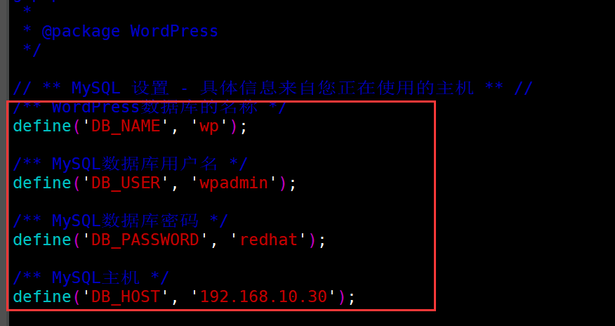
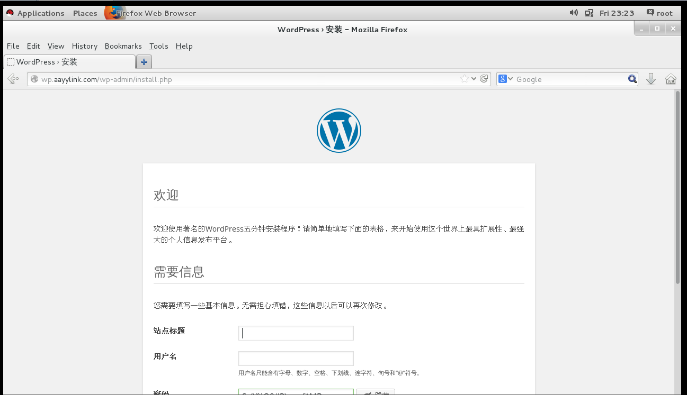
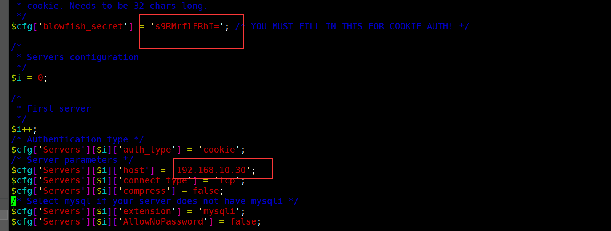
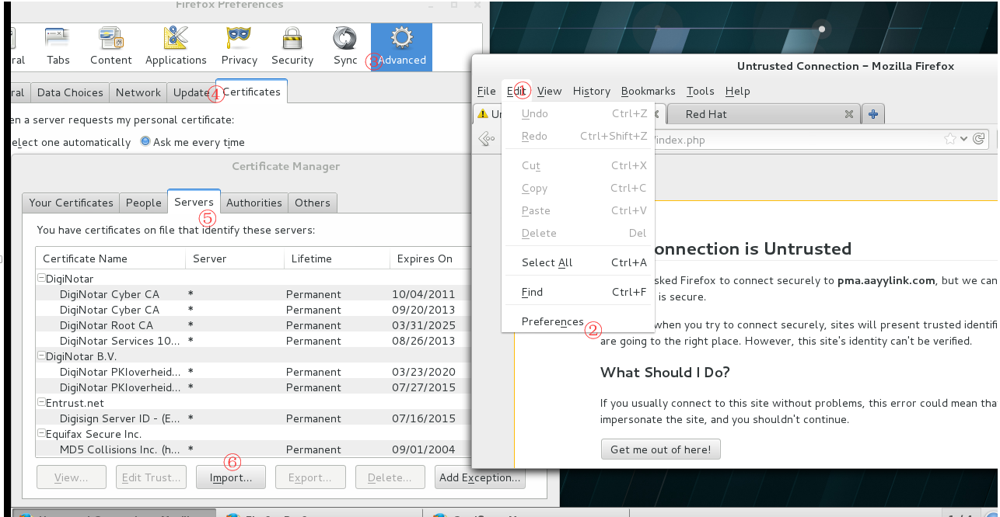
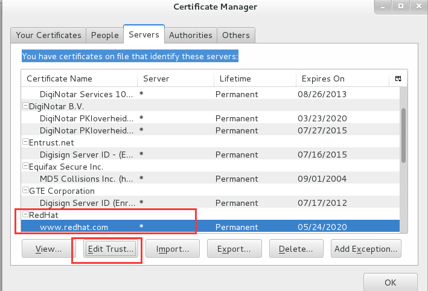
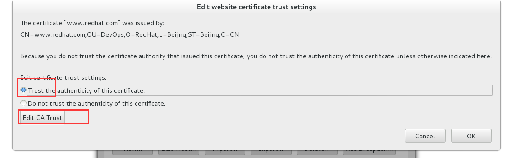
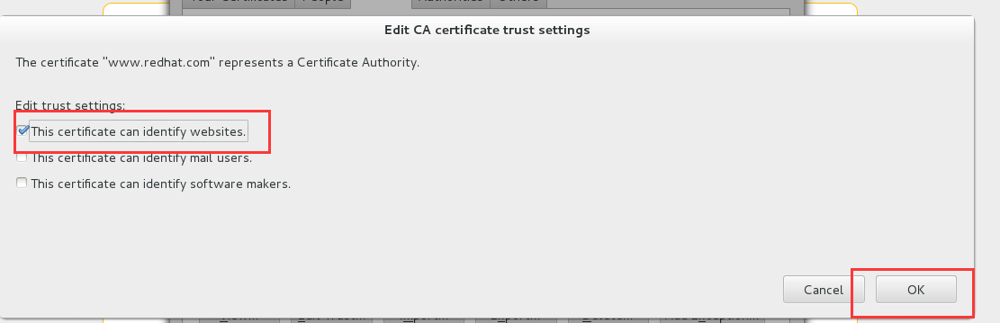

> 提醒：配置时，请务必提前配置好防火墙和关闭selinux。
>
> firewall-cmd --add-service=mysql
>
> setenforce 0 

# 1   博客作业一：CentOS 7, lamp (module)；

```
要求：
	(1) 三者分离于两台主机；
	(2) 一个虚拟主机用于提供phpMyAdmin；另一个虚拟主机用于提供wordpress；
	(3) xcache
	(4) 为phpMyAdmin提供https虚拟主机；
```

**配置的主机及其身份**：

| 主机          | 身份                                  |
| ------------- | ------------------------------------- |
| 192.168.10.10 | httpd服务端                           |
| 192.168.10.30 | MariaDB服务端，并作为CA服务发放CA证书 |

首先安装各个主机上的服务：

httpd服务端：

```shell
[root@10 ~]# yum install httpd php php-mysql mod_ssl php-xcache -y
```

> 注意：php-cache属于epel源，请配置epel仓库。

MariaDB服务端：

```shell
[root@30 ~]# yum install mariadb-server -y
```


MariaDB服务端取消反解功能并初始化数据库

```shell
[root@30 CA]# vim /etc/my.cnf
[mysqld]
skip-name-resolve=ON
...

## 在[mysqld]新增改行即可

[root@30 CA]# systemctl start mariadb
[root@30 ~]# mysql_secure_installation

##接下来就是数据化初始化的交互，若一点都不懂的，全选y就完事了。
```


## 1.1  证书发放配置

> 这个配置只适用于企业内部的设置，若是自己搭建公网网站就免了。

然后先配置发放CA证书的服务端（以下的过程在httpd练习题中都有解释，因此不再解释）：

```shell
[root@30 ~]# cd /etc/pki/CA/
[root@30 CA]# ls
certs  crl  newcerts  private
[root@30 CA]# (umask 077;openssl genrsa -out private/cakey.pem 2048)
Generating RSA private key, 2048 bit long modulus
...........+++
.....................+++
e is 65537 (0x10001)
[root@30 CA]# openssl req -new -x509 -key private/cakey.pem -out cacert.pem -days 365
You are about to be asked to enter information that will be incorporated
into your certificate request.
What you are about to enter is what is called a Distinguished Name or a DN.
There are quite a few fields but you can leave some blank
For some fields there will be a default value,
If you enter '.', the field will be left blank.
-----
Country Name (2 letter code) [XX]:CN
State or Province Name (full name) []:Beijing
Locality Name (eg, city) [Default City]:Beijing
Organization Name (eg, company) [Default Company Ltd]:RedHat
Organizational Unit Name (eg, section) []:DevOps
Common Name (eg, your name or your server's hostname) []:www.redhat.com
Email Address []:
```

客户端发送CA证书请求：

```shell
[root@10 network-scripts]# cd /etc/httpd/
[root@10 httpd]# mkdir ssl
[root@10 httpd]# cd ssl/
[root@10 ssl]# (umask 077;openssl genrsa -out httpd_key.pem 1024)
Generating RSA private key, 1024 bit long modulus
.......++++++
..............++++++
e is 65537 (0x10001)
[root@10 ssl]# openssl req -new -key httpd_key.pem -out httpd_csr.pem
You are about to be asked to enter information that will be incorporated
into your certificate request.
What you are about to enter is what is called a Distinguished Name or a DN.
There are quite a few fields but you can leave some blank
For some fields there will be a default value,
If you enter '.', the field will be left blank.
-----
Country Name (2 letter code) [XX]:CN
State or Province Name (full name) []:Beijing
Locality Name (eg, city) [Default City]:Beijing
Organization Name (eg, company) [Default Company Ltd]:RedHat
Organizational Unit Name (eg, section) []:DevOps
Common Name (eg, your name or your server's hostname) []:pma.aayylink.com
Email Address []:    

Please enter the following 'extra' attributes
to be sent with your certificate request
A challenge password []:      
An optional company name []:
[root@10 ssl]# scp httpd_csr.pem root@192.168.10.30:/tmp/
The authenticity of host '192.168.10.30 (192.168.10.30)' can't be established.
ECDSA key fingerprint is fa:fc:00:85:36:c1:c3:45:69:f0:f5:bd:d6:d4:e4:26.
Are you sure you want to continue connecting (yes/no)? yes
Warning: Permanently added '192.168.10.30' (ECDSA) to the list of known hosts.
root@192.168.10.30's password: 
httpd_csr.pem                       100%  660     0.6KB/s   00:00    
```

CA处理请求：

```shell
[root@30 CA]# touch index.txt serial
[root@30 CA]# echo 01 > serial
[root@30 CA]# openssl ca -in /tmp/httpd_csr.pem -out certs/httpd_csr.pem
Using configuration from /etc/pki/tls/openssl.cnf
Check that the request matches the signature
Signature ok
Certificate Details:
        Serial Number: 1 (0x1)
        Validity
            Not Before: May 25 02:21:10 2019 GMT
            Not After : May 24 02:21:10 2020 GMT
        Subject:
            countryName               = CN
            stateOrProvinceName       = Beijing
            organizationName          = RedHat
            organizationalUnitName    = DevOps
            commonName                = www.aayylink.com
        X509v3 extensions:
            X509v3 Basic Constraints: 
                CA:FALSE
            Netscape Comment: 
                OpenSSL Generated Certificate
            X509v3 Subject Key Identifier: 
                3F:88:E9:6C:4A:2B:8F:1C:DF:77:5F:CF:56:37:9E:58:4E:0D:C6:FA
            X509v3 Authority Key Identifier: 
                keyid:93:78:80:4D:AA:36:F1:99:87:BF:47:EF:F0:A9:4E:A3:74:26:1E:F1

Certificate is to be certified until May 24 02:21:10 2020 GMT (365 days)
Sign the certificate? [y/n]:y


1 out of 1 certificate requests certified, commit? [y/n]y
Write out database with 1 new entries
Data Base Updated
[root@30 CA]# scp certs/httpd_csr.pem 192.168.10.10:/etc/httpd/ssl
The authenticity of host '192.168.10.10 (192.168.10.10)' can't be established.
ECDSA key fingerprint is SHA256:1YSGqp8xswiP1HmQ2UNwm+zdlJfHgv3Sz1zkTTKlShw.
ECDSA key fingerprint is MD5:71:0d:c4:41:ac:99:19:68:9e:86:4c:4a:a0:16:5b:82.
Are you sure you want to continue connecting (yes/no)? yes
Warning: Permanently added '192.168.10.10' (ECDSA) to the list of known hosts.
root@192.168.10.10's password: 
httpd_csr.pem                                    100% 3728     1.6MB/s   00:00 
```

httpd服务端配置SSL证书

```shell
[root@10 ~]# vim /etc/httpd/conf.d/ssl.conf 
... ...
SSLCertificateFile /etc/httpd/ssl/httpd_csr.pem
... ...
SSLCertificateKeyFile /etc/httpd/ssl/httpd_key.pem
... ...

##只需修改以上两行即可。
```


## 1.2 配置wordpress

创建客户端访问的资源的所在目录：

```shell
[root@10 conf.d]# mkdir /data/web/aayylink -pv
mkdir: created directory ‘/data’
mkdir: created directory ‘/data/web’
mkdir: created directory ‘/data/web/aayylink’
[root@10 conf.d]# mkdir /data/web/aayylink/wp
[root@10 conf.d]# mkdir /data/web/aayylink/pma
```

创建wordpress所在的虚拟主机

```shell
[root@10 conf.d]# vim wp.conf
<VirtualHost 192.168.10.10:80>
        ServerName wp.aayylink.com
        DocumentRoot /data/web/aayylink/wp
        <Directory /data/web/aayylink/wp>
                Options None
                AllowOverride None
                Require all granted
        </Directory>
</VirtualHost>
```

先将wordpress压缩包放在资源目录然后将其解压：

```shell
[root@10 wp]# cd /data/web/aayylink/wp/
[root@10 wp]# ls
wordpress-4.3.1-zh_CN.zip
[root@10 wp]# unzip wordpress-4.3.1-zh_CN.zip 
[root@10 wp]# ls
wordpress  wordpress-4.3.1-zh_CN.zip
[root@10 wp]# mv wordpress/* .
[root@10 wp]# rm wordpress* -rf
```

配置MariaDB服务端的服务：

```shell
[root@30 CA]# mysql -uroot -p 
Enter password: 
Welcome to the MariaDB monitor.  Commands end with ; or \g.
Your MariaDB connection id is 14
Server version: 5.5.56-MariaDB MariaDB Server

Copyright (c) 2000, 2017, Oracle, MariaDB Corporation Ab and others.

Type 'help;' or '\h' for help. Type '\c' to clear the current input statement.

MariaDB [(none)]> create database if not exists wp;
Query OK, 1 row affected, 1 warning (0.00 sec)

MariaDB [(none)]> grant all on wp.* to 'wpadmin'@'192.168.10.%' identified by 'redhat';
Query OK, 0 rows affected (0.00 sec)
```

配置wordpress配置文件：

```shell
[root@10 wp]# pwd
/data/web/aayylink/wp
[root@10 wp]# mv wp-config-sample.php wp-config.php
[root@10 wp]# vim wp-config.php
```

修改图中这几行：



> wp-config-sample.php为wordpress配置的样本文件。

配置hosts文件，使其可以解析对应的网址：

```shell
[root@10 wp]# echo "192.168.10.10 wp.aayylink.com" >> /etc/hosts
```

重启服务

```
[root@10 wp]# systemctl restart httpd
```

打开对应的网页即可开始配置，接下来的操作都很简答，就不再赘述。




> wordpress的压缩包下载：
>
> 链接：https://pan.baidu.com/s/1uor8hvqLNtGxCK4h9bZg0w 
> 提取码：uvue 


## 1.3 配置phpMyAdmin

若要使用phpMyAdmin请先安装php-mbstring程序包。

```shell
[root@10 ~]# yum install php-mbstring
```

配置虚拟主机的模块配置文件：

```shell
[root@10 conf.d]# pwd
/etc/httpd/conf.d
[root@10 conf.d]# vim pma.conf 
<VirtualHost 192.168.10.10:443>
        ServerName pma.aayylink.com
        DocumentRoot /data/web/aayylink/pma
        <Directory /data/web/aayylink/pma>
                Options None
                AllowOverride None
                Require all granted
        </Directory>
</VirtualHost>
```

>phpMyadmin的压缩包下载：
>
>链接：https://pan.baidu.com/s/1pIRSKmfg4itgB1y-7REM7g 
>
>提取码：otsz 

将压缩包解压至对应目录：

```shell
[root@10 pma]# pwd
/data/web/aayylink/pma
[root@10 pma]# tar -xzvf phpMyAdmin-4.0.10.20-all-languages.tar.gz 
[root@10 pma]# rm phpMyAdmin-4.0.10.20-all-languages* -rf
```

修改phpMyadmin的配置文件：

```shell
[root@10 pma]# cp config.sample.inc.php config.inc.php 
[root@10 pma]# openssl rand -base64 8
s9RMrflFRhI=
## 生成随机数，待会需要用到

[root@10 pma]# vim config.inc.php
```

只需将生成的随机数复制到红框选中的部分，并将数据库host修改为MariaDB所在的服务器IP。



将分发CA服务器的自签证书转发给客户端，让浏览器添加之：

```shell
[root@30 CA]# pwd
/etc/pki/CA
[root@30 CA]# scp cacert.pem 192.168.10.10:/tmp
root@192.168.10.10's password: 
cacert.pem 
```



然后选中刚刚的pem文件，导入。

然后选中的对应的字签证书，编辑信任：








配置hosts文件：

```shell
[root@10 ~]# echo "192.168.10.10 pma.aayylink.com" >> /etc/hosts
```


