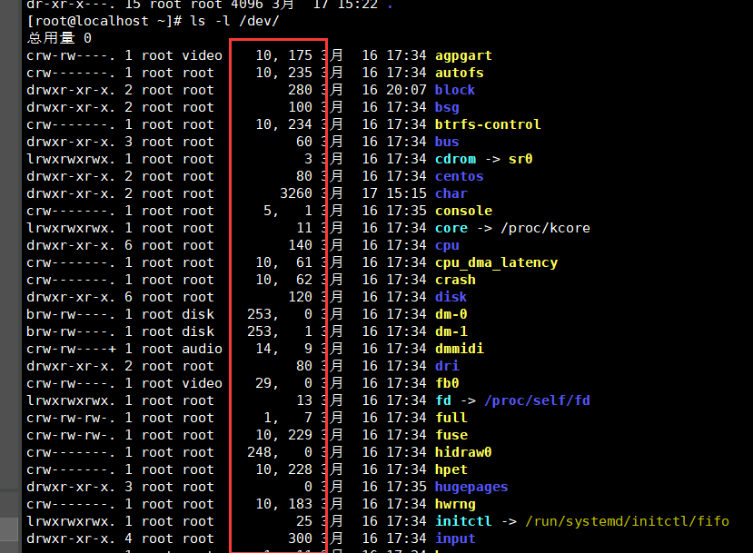
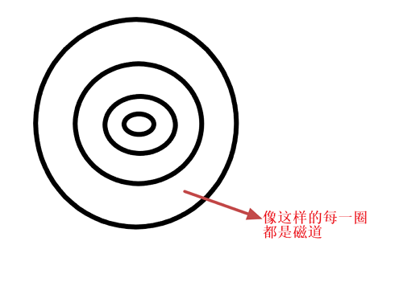

# Linux下的磁盘、文件系统管理

## 1.1  内存和外存的区别： 

​	存储器是计算机的五大组成部件之一。其中的存储器又分为内存和外存。那么内存和外存和外存有什么区别呢，为什么要将存储器分为内存和外存两部分呢？

​	内存和外存最大的区别就是内存是**易失存储器（Volatile memory）**，如果断电就会导致数据的丢失。而外存是**非易失存储器（Non-volatile memory）**，断电后不会导致数据丢失。主板上的内存直接与CPU相连，CPU可以直接通过地址总线和数据总线访问内存，而CPU不会与外存直接交换数据，想要CPU读取外存的数据必须让外存上的数据先读取到内存中，然后让CPU来间接访问外存的数据。

​	目前的计算机采用内存和外存两种存储器的原因有上面说到的“内存断电丢失数据，外存不会之外”。还有很大的原因就是价格。一个128G的固态硬盘可以卖两三百元，而一个4G的内存却足以卖两三百元了。

## 1.2   Linux中的设备驱动

​	**Linux下的设备分类：**一类为**字符(char)设备**，存取的单位为“字符”，例如键盘；另一类为**块设备**(block)，存取的单位为“块”，本节所介绍的硬盘设备就属于块设备。

​	Linux下一切皆文件，设备也是一样，Linux上所有设备的操作都是通过文件接口来实现的。每一个设备都有一个对应的**设备文件**作为它的访问入口，设备文件必须关联对应的**设备驱动程序**，才能使它与对应的设备进行通信。

​	现在有两个问题，能充分理解设备、设备文件和设备驱动程序三者之间的关系，第一个问题就是：如果有现在一台主机上有两个同样的设备，那这两个设备是要关联几个设备文件呢？答案是要关联两个设备文件，即设备和设备文件之间的映射关系为一对一的。第二个问题：那多个同种设备文件和设备驱动程序的映射关系是怎么样的呢？多个同种设备文件和设备驱动程序的映射关系是多对一的。总结一下就是：**每一个设备关联一个设备文件，多个同种设备的设备文件关联一个设备驱动程序**。

​	设备文件只是用户看到的访问入口，所以设备文件的命名自然而然是符合人类的阅读的字符串。而对于计算机而言，计算机更容易阅读的是一串数字，而在Linux中，每一个硬件设备在内核集中都是靠一个设备号来进行标识的，这就方便了硬件和系统的识别。

**设备号的组成：**

**主设备号(major number)**：标识设备类型，用于标明设备所需的驱动程序

**次设备号(minor number)**：标识同种设备类型的不同设备，是特定设备的访问入口。

​	Linux中的/dev目录存储的都是各种各样的设备文件，我们可以使用"ls-l /dev"指令可以查看到该目录下设备文件的设备号：

注意红色框中的内容，这些就是所谓的设备号，用逗号将主设备号和次设备号隔开，逗号左边为主设备号，逗号右边为次设备号。

可以使用mknod(make block or character special files)指令来创建一个设备文件：

**mknod命令的使用方式**：

mknod  [OPTION]...  NAME  TYPE  [MAJOR  MINOR]
		TYPE：为设备类型，可指定c,b
		-m MODE：创建后的设备文件的访问权限；

**mknod的使用例子**：创建一个新的块设备文件。

1、注意创建的设备文件不能和其他同种设备文件拥有相同的次设备号，否则系统将会出现识别混乱的错误。所以像下图一样查找对应的相同文件。

2、创建一个不与当前设备文件设备号冲突的文件。

创建完成。

## 1.3  硬盘接口类型及其在Linux下的命名

#### 1.3.1  设备的分类

​	我们通过硬盘接口类型来区别不同的硬盘，不同的驱动程序是靠自己的硬盘内部的工作电气特性来实现的。

​	硬盘接口有串口和并口这两类，每一类都包含了多种硬盘接口。

**并口(parallel port)**：数据传输有n根线并行传输

**串口(serial port)**：数据传输仅有一根线按照顺序传输

串口和并口包含的接口的类型及其**IOPS**(Input/Output Operations Per Second，每秒的读写次数)：

**串口**：

​	SATA：6Gbps(6 Gb per second)

​	SAS：6Gbps

​	USB：480MB/s

**并口**：

​	IDE：133MB/s

​	SCSI：640MB/s

> 注意：上述中的B为Byte，b为bit

#### 1.3.2  设备的命名

**在Linux中的磁盘设备文件命名情况如下**：

​	IDE：/dev/hd[a-z]

​	SCSI,SATA,SAS,USB：/dev/sd[a-z]

不同的设备的设备文件名在其后追加的字母不同，一般按磁盘接入计算机的先后顺序附加a到z来命名。

**磁盘分区命名**：磁盘设备在分区后，会为分区创建一个新的设备文件，其名称为在原来的磁盘设备文件名后加上[1-∞]来表示。例如:/dev/hda1,/dev/sda3。

## 1.4  机械硬盘的组成

​	学习机械硬盘的构成有利于我们更好的理解Linux的分区过程，因此下面介绍下机械硬盘的组成和运作原理。

#### 1.4.1  机械硬盘的构造

​	机械硬盘主要由盘片、轴、旋转马达、机械臂、磁头五个部分组成（当然还有其他部件，但是这是构成机械硬盘的最关键的部分，明白这五个部件的原理，你就懂了机械硬盘的运作方式）。硬盘的具体构造参考下图。

​	首先盘片固定在旋转轴上，马达会带动旋转轴旋转，机械臂上带有磁头，磁头悬浮在盘面上，用来读写盘片上的数据，机械臂可以伸缩来进行寻道。

​	一个盘片可以划分成N个多个同心圆，称之为磁道。是真正用来存取数据的地方；磁道上存取的数据大小取决于现代技术的工艺。磁道的表示像下图。

​	现在的硬盘都是双面读写的，所谓双面是一个盘片的上下两面均可读写；每个盘面上的相同位置都会有一个相同的编号，所有相同编号的磁道称之为**柱面**。磁盘上的每个磁道被等分为若干个弧段，这些弧段便是磁盘的**扇区**。

**扇区的划分**：

​	将每一个磁道按512个字节为单位划分为等分，叫做扇区的划分；一些硬盘的参数列表上会有写明每个磁道的扇区的参数，通常以一个范围来表示，例如：373\~746，这表示最外圈的磁道有746个扇区，最内圈的磁道有373个扇区，可以通过换算磁道的容为(186.5KB\~373KB)

#### 1.4.2 磁盘如何分区

​	根据磁盘的内部结构分析，所有的磁头都是同时运动的。机械臂的运作速度相比于盘面的转速是相当慢的。所以当要读写一个文件数据的时候，如果这个文件数据的内容仅仅分布在一个盘面上的话，操作时间是很久的，所以一般情况下会把文件的内容分布在多个盘面上的同一个磁道上，这样通过多个机械臂上的磁头同时读写数据，速度会大大提升，而磁盘的分区正是如此运作的，磁盘的分区是根据柱面来划分的。另外，由于角速度相同这样的物理原因，外圈的读写速度肯定会比内圈快。

注意：每一个盘面上一个柱面只能属于一个分区，而且由外向内多个柱面组合成一个分区。越靠外的柱面读写速度越快，所以通常会用最外层的多个柱面来作为系统分区。

#### 1.4.3  MBR(Master Boot Record,主引导记录)

​	一个硬盘就是一个存储空间，分区是需要人为来划分的，分区信息是没办法保存在分区内部的某块空间上，那分区信息应该保存在哪？在硬盘上有一个叫做0磁道0扇区是被预留出来的，它不会被划分给任何的分区，这个扇区被称为MBR，严格意义上叫做用来存储MBR的一段空间。

​	0磁道0扇区是专门用来存储MBR的空间，这个扇区的大小为512bytes。

**MBR的三个组成部分：**

- 446bytes：用来存储boot loader，引导加载器；

- 64bytes：用来存储分区表，分区表的内容包括**主要分区(primary partition)**的数量和主要分区的起始和结束位置，每个主要分区需要16bytes，所以采用MBR分区结构的硬盘最多只能有4个主要分区。想得到4个以上的主要分区是不可能做到的，但是可以通过扩展分区()来弥补这个不足，扩展分区也是一种主要分区，但是**扩展分区(extended partition)**可以分为无数个**逻辑分区(logical partition)**，这弥补了主要分区只能分4个的不足。

- 2bytes：前面的信息有效性表示（或者叫做结束标志），用四个16进制数来表示55AA，表示前面510bytes是有效的。

  

  

  一般情况下会将一块采用MBR分区结构的磁盘划分为3个主分区+1个扩展分区。

  

  **注意**：当磁盘容量超过2T时，以MBR的机制是无法识别2T以后的磁盘空间的，此时就需要另一种名叫GPT的机制来分区了。

  

  

  超级块：

  元数据：

  低级格式化和高级格式化:

------

本博客中硬盘图片是引用它人，如果造成侵权，请告知我，我会立即删除，联系邮箱：445701902@qq.com。

GPT将磁盘所有区块以LBA来规划，LBA(logical block address逻辑区块地址） LBA从0开始编号，GPT采用34个LAB（每个LAB默认大小512字节）区块来记录分区信息，整个磁盘最后，也有34个LAB 作为备份！

LBA0  作为MBR兼容区块，平常一般用不到！ 512字节，就相当于mbr的一个山区了！  LBA1 就记录分区表的位置和大小！和磁盘最后34个LAB的位置

LBA2-33 就记录分区了！ 每个区块可以记录四组分区星系，所以gpt的分区个数，可以达到128个

每个LBA 大小512字节，相当于之前mbr的一个扇区！  三十二个扇区存放分区信息

mbr的三十二倍！

每组分区，使用64bit记录区块号！ 也就是说，最大可以记录2的64次方个LBA，算一下，单个磁盘，最大就是，不知道多大了

根据笔记来看，最大支持单个磁盘容量达到8ZB,1ZB =2^30TB 

