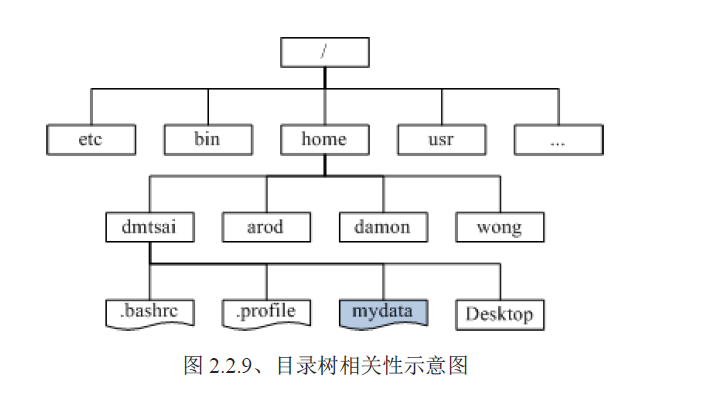

@[toc]

# 1. 计算机的组成及其功能

​	学习Linux需要一些很基础的计算机组成原理的知识，但是我们并不需要深究，只要学习一些对于以后Linux的学习有用的知识就好。

**现代计算机主要由五大部件组成**：运算器，存储器，输入设备，输出设备以及控制器（运算器和控制器存在于CPU中）。接下来我会简单介绍这五大部件的基本功能，以及相互之间是如何一起工作的。

首先介绍五大部件的基本功能：

- **存储器**：存储器有分内存和外存，两者有很大的区别，所以下面就分成两个内容介绍：

  - **内存**：指那些**易失性存储器**（Volatile memory），每当进程(进程就是电脑运行中的一个个软件，像qq，word这些**正在运行**的软件，我们都可以称之为进程)关闭后，进程保存在易失性存储器的内容就会消失。
  - **外存**：是指那些**非易失性存储器**(non-volatile memory，例如：CD，软盘，磁盘)，这些存储器中的内容在电源断电后都会一直保存。

  

  > 进程的概念很重要，因为后面也会讲到涉及到这个知识点的命令，因此在此介绍一下：
  >
  > 进程就是我们电脑中运行的一个个程序，注意**""运行""**这两个字，因为没有运行的程序并不是进程，而只是一段数据，而且这段数据是保存在外存上的。程序和进程可以用静态和动态来区别：程序是静态的，进程是动态的。

- **运算器**：负责算数运算，计算机中的加减乘除都需要用到运算器

- **控制器**：负责控制计算机运行的部分。例如：当我们需要从外存启动一个程序时，那么启动后的进程的数据就会保存在内存里，这段操作都需要控制器来负责，是控制器控制硬盘使其将自己的代码段传输到内存里面的。
- **输入设备**：指那些向计算机输入数据的设备，一般常见的输入设备有键盘、鼠标、摄像头、扫描仪。
- **输出设备**：指那些用来接收计算机输出的数据的设备，一般常见的有显示屏、打印机。

上面五个部件运行时的关系如下图：

图中的控制线箭头指向被控制的部件箭尾都指向控制器，表示在计算机五大部件中都是由控制器来控制其他部件的运行。数据线的箭头指向的是数据被读取的方向。

一般情况下在用户执行一个1+1的运算时的步骤：

1. 先让控制器控制输入设备，使其输入的数值有效，接着输入设备输入两个1。
2. 控制器控制存储器，使其读取并保存两个1数值。
3. 控制器控制运算器去读取两个1。
4. 控制器控制运算器执行两个数值的加法运算。
5. 运算器运算完后，控制器控制存储器读取运算器中的内容。
6. 控制器控制输出设备去读取存储器的内容，输出设备将其输出

计算机组成原理的知识就讲到这，这些知识足够Linux的入门了。

​	

# 2.  内核概念介绍及其作用

​	内核是指大多数操作系统的核心部分。在操作系统中起着管理存储器、文件、外设和系统资源的作用，并可以为进程间提供通信。总的而言，操作系统为上层软件提供了系统调用的界面。

​	内核所在的层次如下图所示：

# 3.  Linux发行版概念介绍及常见的发行版

#### 3.1  什么是Linux发行版？

​	Linux的发行版指的是在Linux原有内核或原有发行版上进行修改、添加各种额外的功能之后发行的Linux版本。

> 在原有发行版上做修改后再次发行的叫做**再发行版**。

目前Linux的发行版多的惊人，下面给出一张1992-2010年的Linux发行版图。

作为Linux初学者，我们只需要学习几个主流的发行版即可。

#### 3.1  常见的Linux发行版

​	接下来按照Linux的再发行版分支关系来介绍Linux的发行版

**RedHat9.0的再发行版**：

- **RHEL**：扩称为Red Hat Enterprise(红帽企业版)，RHEL是RedHat发行的商业操作系统，其靠着卖服务来获取利润。
  - **CentOS7**：扩称为Community Enterprise OS，这个系统是RHEL的社区版本，这个发行版起初是由社区极客维护的，不过后来被红帽公司收购了。
- **Fedora Core**：这个版本也是受社区开发的，Fedora 项目由 Fedora 基金会管理和控制。

**Debian的再发行版**：

- **Ubuntu**：该发行版有着Linux众多操作系统中最美的可视化界面。
  - **Mint**：其设计的目标是为了提供用户更完整的即可可用体验。相对于Ubuntu加入了很多方便的功能。它诞生的目的是为家庭用户和企业提供一个免费的，易用的，舒适而优雅的桌面操作系统。
- **KNOPPIX**：他可以自动硬件检测，支持常见的显卡、声卡、SCSI和USB设备以及其他外设。

**Slackware的再发行版**：

- **SUSE**：是提供完整德文使用界面的产品。
  - **SLES**：扩称为SUSE LinuxEnterprise Server，是SUSE下的一个企业服务器版本。
  - **OpenSUSE**：对个人来说是完全免费的，包括使用和在线更新。拥有专业，易用的YaST软件包管理系统，安全的AppArmor，是结合了德国人工程质量的发行版。

其他常用的发行版：Gentoo、ArchLinux。据说ArchLinux很适合新手进行Linux的入门。

# 4.  开源协议

#### 4.1  开源的概念：

​	开源指的是开放源代码，意思是所有人都可以查阅你软件或操作系统的源代码。为了更好的建立更好的开源社区和维护开源代码，很多人建立了一些开源的协议。

4.2  常见的开源协议及其内部规则

- **GPL**：扩称为GNU General Public License(GNU通用公共授权)。只要软件中包含了遵循GPL协议的产品或代码，该软件就必须也遵循GPL许可协议且开源、免费，因此这个协议并不适合商用软件。

  ​	

  **规则**：软件可以随意传播；不可以将软件进行出售，但是可以通过卖软件相关的服务盈利；		    如果原先遵循GNU协议的软件被修改，修改后的软件也需要遵循GNU协议。

  

- **BSD**：扩称为Berkeley Software Distribution(伯克利软件发布版)。是在1977至1995年间由加州大学伯克利分校开发和发布的。

  ​	 **规则**：软件可以被再发布，并且可以将其作为商业软件进行发售。但是得满足三个前提：**1**.		     如果再发布的软件包含遵循BSD协议的源代码，则源代码必须继续遵循BSD许可协		     议。**2**. 如果再发布的软件中只有二进制程序，则需要在相关文档或版权文件中声明原		     始代码遵循了BSD协议。**3**.不允许用原始软件的名字、作者名字或机构名称进行市                        		     场推广。

  

- **Appache**：扩称为Apache License Version(Appache开源协议)。是著名的非盈利开源组织Apache采用的协议。

  ​	

   **规则**：在为开发人员提供版权及专利许可的同时，允许用户拥有修改代码及再发布的自由。

  ​		      再发布的软件需要遵循4个前提：**1.**该软件及其衍生品必须继续使用Apache许可协		      议；**2**.如果修改了程序源代码，需要在文档中进行声明。**3**.若软件是基于他人的源代		      码编写而成的，则需要保留原始代码的协议、商标、专利声明及其他原作者声明的		      内容信息。**4**.如果再发布的软件中有声明文件，则需在此文件中标注Apache许可协		      议及其他许可协议。

  

- **LGPL**：扩称为Lesser General Public License(GNU 宽通用公共许可证)，是更为宽松的GPL，也是GNU为了得到更多的甚至是商用软件开发商的支持而提出的。

  ​	   

  **规则**：对于修改遵循LGPL的代码或者其衍生的代码，修改部分需要遵循LGPL协议。

# 5.  Linux的哲学思想

以下介绍Linux的哲学思想，这些思想可以让初学者更易理解Linux的运行机制。

1. 一切皆文件。在Linux下所有的一切都是文件，包括硬件和对程序的配置，都是通过文件的方式保存的。硬件对应的文件被称为设备文件，一般保存于/dev目录下。配置文件通常都保存在/etc目录下
2. 复杂的功能由众多功能单一的程序组合完成，一个程序只做一件事，并且做好，组合个小程序完成复杂任务。在Linux下，很多程序若要运行需要预先安装好其依赖项，因为大部分程序的运行需要其他程序的支撑。
3. 尽量避免跟用户交互；目标：易于以编程的方式实现自动化任务。Linux的自动化特点使其更易于在生产环境中的使用。
4. 使用文本文件保存配置信息。这个哲学思想也属于一切皆文件的范畴。Linux下很多服务的配置都需要修改其配置文件，但是需要注意的是这个配置文件是属于文本文件，是人可以看懂的，也是服务可以读取其来进行配置的。

# 6.  Linux的目录结构及其意义

Linux的目录是以树的结构组建的。以根目录为起点向下不断衍生分支，其具体结构如下所示：

需要注意的是根目录下的目录绝大多数都有意义的，接下来介绍各个根目录下的目录及其意义：

- etc：该目录下保存了众多配置文件
- bin：该目录下保存了一般用户也可以使用的程序
- sbin：该目录下保存了系统管理员可以使用的程序
- home：该目录中保存了用户的家目录
- usr：注意该目录不是user的缩写，而是Unix Software Resource的缩写，是Unix操作系统软尖子源放置的目录。用来保存系统默认安装的程序，相当于Windows系统下的C:\Windows\和C:\Programfile\两个目录的结合体。
- dev：用来保存设备文件的目录
- proc：该目录是一个虚拟文件系统，所保存的文件都是在内存中的。
- lib：保存32位系统的库文件，通俗的将是公共的共享程序的部分
- lib64：保存64位系统的库文件
- opt：第三方软件保存的目录

**注意**：这些目录不能随便删除，因为系统开机的时候一般需要使用得到这些文件。

------

本博客参考了《鸟哥的Linux私房菜基础篇》，这本书真的是学习Linux的必读书籍，其内容及其丰富，目录的编排也非常合理，可以相当于学汉语时所用的中华字典了。大家可以去买一本实体书当工具书或者入门学习的书，也可以网上查找其电子书来阅读。

