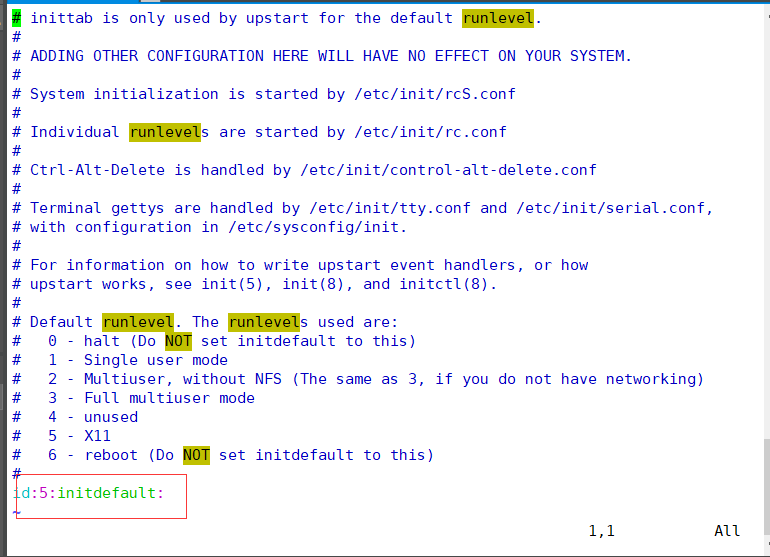
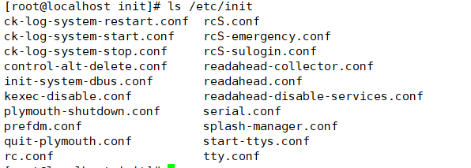

[TOC]


# 0.  引入

本篇博客会讲解CentOS的启动流程和学习CentOS启动流程的基础。本篇博客的启动流程知识只适用于PC架构和MBR架构的启动流程，虽然现在的很多操作系统已经使用UEFI和GPT架构了，但是本篇博客讲解的架构比较经典，学习完这种架构的操作系统后，对于其他操作系统也是触类旁通了。


## 0.1  为什么要学习CentOS的启动流程呢？

运维人员不可避免的会使用安全模式，而安全模式正是用户在系统的启动流程中触发的，学习CentOS的启动流程就可以更加深入理解用户调用安全模式的过程；当然了调用安全模式仅仅只是系统启动流程中的一个小过程，作为运维人员学习系统启动流程可以深入的理解CentOS的一部分工作原理，并为学习内核的编译打下一定的基础(一般而言，作为运维工程师都不可避免的需要学习Linux的内核编译)；在运维工作中，若出现主机无法启动或启动异常的情况，就需要运用到CentOS启动流程的知识，提出对应的解决方案。


## 0.2  CentOS的启动流程指的是什么？

CentOS的启动流程指的是从主机加电自检到创建第一个init进程的过程。


# 1.  学习CentOS系统启动流程的基础

这一大节会介绍各种各样的概念，这些概念都是学习CentOS系统启动流程的基础。


## 1.1  Linux的系统组成

Linux系统由内核和根文件系统组成。CentOS的启动流程的学习会涉及到内核和根文件系统的概念，因此下面会介绍内核的功能和根文件系统应有的特性。


**内核的功能**：内核的功能有进程管理、内存管理、网络协议栈、文件系统、驱动程序和安全功能

> 进程管理包括进程创建、关闭、调度和进程间的通信等，这里稍微介绍下进程管理中的进程间的通信。
>
> IPC(Inter Process Communication,进程间通信)：在本地进程间的通信方法有：消息队列、semaphore、shm(shared memory)；在不同主机进程间的通信方法有：socket,rpc(remote procedure call)

**运行中的系统环境可分为两层**：

​	**用户空间**：用户空间上的活动是执行用户进程

​	**内核空间**：内核空间上的活动有两种，一种是执行关于内核的进程，第二种是处理中断。


**根文件系统应有的特性**：根文件系统应该拥有FHS目录结构(FHS目录结构指的是目录下有/bin,/boot,/sbin等目录)和init文件


## 1.2  内核设计流派

操作系统内核可以分为两大流派，即：**单内核**和**微内核**(还有一种叫做外内核，一般在科研系统中使用)。


### 1.2.1  单内核

**单内核的设计理念**：所谓的单内核指的就是将所有的功能都集成于一个程序中，而当运行时也将程序放在一个单独的地址空间上。

**单内核设计的优缺点**：单内核的**优点**就在于：由于所有的功能都放在一个程序中实现，所以内核之间的通信是不微不足道的。而单内核的**缺点**就在于：一个功能的失效会影响到另一个功能的工作。

**单内核的操作系统举例**：Linux,Unix


### 1.2.2  微内核

**微内核的设计理念**：微内核不想单内核一样将所有的功能集成在一个程序中。恰恰与单内核相反，微内核针对每种功能都使用一个单独子系统来实现

**微内核设计的优缺点**：微内核的优缺点和单内核的优缺点正好相反。微内核的**优点**：微内核中各个子系统之间相互独立，一个功能的失效并不会祸及另一个功能的工作。微内核的**缺点**：微内核的**缺点**：微内核各功能之间的通信需要通过消息的传递，这种消息传递称为IPC(Inter-Process Communication,进程间通信)，而这样的通信是需要开销的。

**微内核的操作系统举例**：Windows NT


> 上面说过Linux是一个单内核的操作系统，不过Linux却也汲取了微内核的精华，Linux也有着模块化设计、抢占式内核、支持内核线程以及动态转载内核模块的能力。不仅如此，Linux还避免了微内核设计上性能的缺陷，让所有事情都运行在内核态，直接调用函数，无须消息传递。至今，Linux是模块化的、多线程的以及内核本身可调度的操作系统，实用主义再次占了上风。
>
> 上面的内容摘抄于《Linux内核设计与实现》


## 1.3  Linux内核相关概念

**Linux内核的模块化特点**：支持模块化(模块文件的名称格式为Name.ko，其中ko表示kernel object)；支持模块化运行时装载或卸载。


**Linux内核的组成部分**：下面说讲述的是Linux内核静态(以文件的形态)保存时的组成部分

​	**核心文件**：保存格式为/boot/vmlinuz-VERSION-release（VERSION指的是版本，release是发行版本,vmlinuz的z表示该文件是压缩过的）

​	**模块文件**：保存于/lib/modules文件夹下

​	**ramdisk**：在CentOS5下的保存格式为：/boot/initrd-VERSION-release.img；CentOS6和7的保存格式为/boot/initramfs-VERSION-release.img(从扩展名是.img可以看出该文件是一个磁盘映像文件)。ramdisk是一个临时根文件系统，是在CentOS开机流程时需要使用到的。后面会详细介绍。

> 可以看到ramdisk的文件名称格式从intitrd转变为initramfs，其中的rd--->ramfs也就是从磁盘转换成了文件系统，用fs替换rd原因是因为避免双缓冲。


## 1.4  ramdisk详细介绍

在学习ramdisk之前，我们需要思考一个问题，这个问题就是系统开机过程中的“先有鸡还是先有蛋？”的问题，问题如下：

内核存放在启动分区上，启动分区在对应的磁盘上，而要使用这个磁盘则需要使用到对应的磁盘驱动程序，但是加载驱动程序的功能是由内核负责的。因此磁盘不能被驱动便导致内核无法被内存读取，内核无法被读取则导致磁盘 不能被驱动。这就是鸡和蛋的问题。


为了解决鸡和蛋的问题，就需要借助于上面所述的临时根文件系统---ramdisk了。

**ramdisk的概念**：虚拟内存盘，是通过软件将一部分RAM(内存)模拟为硬盘来使用的技术。

ramdisk作为一个临时根文件系统也有着根文件系统中的目录结构和/lib/modules中保存着的对应驱动程序。将内存模拟成硬盘后，就可以从中加载真正根文件系统所在的磁盘对应的磁盘驱动程序，之后就可以加载真正的根文件系统了。真正根文件系统启动后，临时根文件系统会让位。


ramdisk的创建是在操作系统安装时进行的。创建时会扫描底层的硬件设备，使得模块当中只保存对应于底层的硬件设备的驱动程序。这样的做法可以避免内存的浪费。

> ramdisk并不是开机过程中必要使用的。


# 2.  CentOS启动流程

再次声明，以下的启动流程概念只适用于PC架构且是MBR架构的主机。


先总体的概括下CentOS的启动流程为：

1. 加电自检(POST)
2. 选择启动顺序，加载MBR(Boot Sequence)
3. 加载内核，执行系统初始化信息
4. 以只读的方式挂载根文件系统
5. 启动用户空间第一个执行程序/sbin/init

以上除了挂载根文件系统的其他每个过程都需要展开细讲，接下来的内容就会详细讲解各个过程中都发生了什么。


## 2.1  POST

**POST过程概括**：加电自检步骤主要是检查做硬件设备是否存在并且可以正常运行否(像键盘、鼠标这样的硬件若不存在是不会影响到开机的)。


**BIOS**：Basic Input Output System,基本输入输出系统。自检的功能就是保存在这个软件程序中的。该程序固化在主板上的CMOS上。


> BIOS也有不保存在主板上的情况，但对于PC机大多数情况下保存在主板上。
>
> CMOS是一种ROM。


**更深入来说POST过程**：加电过程就是给CMOS通电，然后启动其上的BIOS程序，BIOS程序会根据CMOS上面的一些配置信息去读取其他的硬件设备信息并检测其是否存在并能正常运行，之后进行对硬件设备的初始化。


## 2.2  Boot Sequence

这个过程会按次序查找各个有引导程序(boot loader)的设备，选择第一个有引导程序的设备作为本次启动要用到的设备；借助引导程序选择需要加载的内核；加载选定的内核之后将控制权交给内核。


### 2.2.1  引导程序概念及作用

引导程序可以提供选单让用户选择要加载的内核。另外不同的操作系统的文件系统类型是不一样的，不同类型的文件系统之间是不相兼容的，而借助引导程序就可以避免这个问题。

Linux的引导程序还可以提供菜单信息，让用户选择其他的引导程序，并将启动管理功能转交给其他的引导程序。例如：在一台电脑上装了Windows和Linux两个系统，就需要借助引导程序选择开启的系统了。

> 安装Windows和Linux双系统的注意事项：
>
> 安装Windows和Linux双系统时需要先安装Windows，再安装Linux，在安装Linux的过程中需要确认Linux的引导程序安装在MBR上。
>
> 原因如下：
>
> 所有系统安装时会默认安装一份引导程序到其系统分区所在的扇区中，需要注意的是Linux系统在安装的时候，会询问我们是否要将引导程序安装到MBR上，而Windows却不会询问我们的意愿，直接将他自个的引导程序安装到MBR上，更坑爹的事情来了，Windows的引导程序并没有控制权转交功能，所以不能使用Windows的引导程序去加载Linux的引导程序。所以如果你是先安装Linux系统再安装Windows系统就会导致原来的Linux系统不能被开机了(当然通过引导修复软件还可以补救一下)。


无可避免的，每个程序都需要保存在硬盘上，而引导程序的保存形式比较特殊，他保存在第一个可以启动的硬盘的第一个扇区上，也就是MBR当中。

> 现在还有新的磁盘分区模式，例如UEFI，GPT。


引导程序有很多种，常见的引导程序有：Windows的ntloader，Linux下的LILO(由于不支持超过1024柱面的硬盘，所以已经很少见了)和GRUB。

不同的引导程序所进行的行为也大相径庭，接下来就以GRUB引导程序为例，仔细讲讲引导的过程。


### 2.2.2  GRUB引导程序

**GRUB启动的过程可以划分为三个阶段：**

**第1阶段**：运行Boot Loader主程序，由于MBR大小的限制，使得Boot Loader的大小不能超过446字节，而446字节的大小根本没办法保存一个具有丰富功能的引导程序。因此GRUB做了拆分，仅将关键的主程序保存在Boot Loader当中。

**第1.5阶段**：这个阶段主要负责与第2阶段所需要使用到的文件的所在分区的文件系统进行交互。

**第2阶段**：通过Boot Loader加载所有配置文件及相关的环境参数信息，这些配置文件及相关的环境参数都存放在挂载在boot的磁盘分区中的/boot/grub目录下。完成配置文件的读取后就可以提供菜单界面供用户选择要加载的内核。

> GRUB2的第2阶段其实并不仅仅只提供菜单界面，他还提供了各种各样的接口。其功能丰富到加载完所有配置文件的引导程序可以被作为启动操作系统之前的操作系统。


**GRUB引导程序版本**：

GRUB 0.x版本，被称为GRUB Legacy：是CentOS6使用的GRUB

GRUB1.x版本，被称为GRUB 2：是CentOS7使用的GRUB

以上两个版本完全不同

> GRUB Legacy常作为安卓手机所使用的引导程序。GRUB2在Linux界逐渐取代GRUB Legacy


## 2.3  内核初始化

内核初始化的过程如下：

1. 探测可以识别到的所有硬件设备(这个过程和加电自检是不同的)

2. 加载硬件驱动程序(有可能要借助到ramdisk加载驱动)

3. 以只读方式挂载根文件系统

4. 运行用户空间的第一个应用程序：/sbin/init


> 创建init后，用户空间有init接管，除非用户空间的进程有中断和访管指令。


## 2.4  启动init程序

我们讲到过init是一个由内核也是第一个启动的进程，想必这第一个进程所需要完成的任务也是很多的。那么下面我会笼统的概括一下init程序究竟会做些什么，然后对init实现这些功能的方式做出详细的解释。


### 2.4.1  init完成的任务概括

1. 设置默认运行级别
2. 运行系统初始化脚本，完成系统初始化
3. 关闭对应级别下需要停止的服务，启动对应级别下需要开启的服务
4. 启动登录终端
5. 若默认运行级别为5，则需要启动图形终端


### 2.4.2  init的运行级别

运行级别是为了为了系统的运行和维护等目的而设定的机制。

有7个运行级别：

​	0：关机，shutdown

​	1：单用户模式(single user)，是维护模式。单用户指的就是root，登陆时无须验证。

​	2：多用户模式(multi user)，是维护模式。需要用户认证，会启动网络功能，但不支持NFS。

​	3：完全多用户模式，是正常级别。使用文本界面。

​	4：预留级别，尚未特别定义其功能，若要使用其，则功能同3极

​	5：完全多用户模式，是正常级别。使用图形界面。

​	6：关闭所有服务后重启。


正常情况下使用的都是3和5的运行级别。我们可以使用`runlevel`或者`who -r`命令来查看当前运行的级别。

假若要切换运行级别，则可以使用`init RUNLEVEL`命令来切换。


### 2.4.3  init的配置文件

首先要知道init的配置文件有很多种类：

​	CentOS 5：SysV init

​		配置文件是：/etc/inittab

​	CentOS 6：Upstart(是Ubuntu研发的)

​		配置文件：/etc/inittab(该文件几乎不起作用，但是为了向后兼容才保留下来)

​			/etc/init/*.conf

​	CentOS 7:Systemd

​		配置文件：/usr/lib/systemd/system,/etc/systemd/system

>需要注意的是：虽然CentOS7已完全废除了运行级别，但是CentOS7为了向后兼容也可以使用"init RUNLEVEL"来达到相同的目的。


我们接下来以CentOS 5为例讲解一下：/etc/inittab配置文件的书写格式

**CentOS 5配置文件内容格式**：

/etc/inittab的每一行定义一种action以及与之对应的process。

每一行的内容如下

id:runlevel:action:process

**各字段的意义**

**id**：指的是任务的唯一标识符

**runlevel**：在哪些级别启动此任务，可以指定多个(各运行级别之间无须衔接任何字符)，若未空则表示所有级别。

**action**：定义启动的条件

**process**：执行的任务


**action的内容及意义**

​	**wait**：等待切换至此前面runlevel指定的级别时，执行一次

​	**respawn**：此任务终止时，就自动重新启动之；例如终端上的登陆程序

​	**initdefault**：设定默认运行级别；写该行时，process省略

​	**sysinit**：设定系统初始化方式，此处一般借助/etc/rc.d/rc.sysinit脚本来初始化


**配置信息示例**

接下来我们以系统中以有的配置信息为例，进一步理解/etc/inittab文件的配置：

id:3:initdefault:	设置系统的默认运行级别

si::sysinit:/etc/rc.d/rc.sysinit	设定系统初始化所要用到的脚本

l0:0:wait:/etc/rc.d/rc 0	转换至0的运行级别时需要运行脚本`/etc/rc.d/rc`并传入参数0。同样的还有l1~l6

... ...

l6:6:wait:/etc/rc.d/rc 6


tty1:2345:respawn:/usr/sbin/mingetty tty1 	该行和以下的五行都是用来设定终端的。

... ...

tty6:2345:respawn:/usr/sbin/mingetty tty6

### 2.4.4  /etc/rc.d/rc文件详解

从上面的内容知道l0:0:wait:/etc/rc.d/rc 0的作用后，我们来讲解一下`/etc/rc.d/rc`这个脚本。

**/etc/rc.d/rc脚本的作用**：该脚本会接收一个运行级别为参数，假设这个参数为"#"，然后以该参数为依据开启或关闭所有/etc/rc.d/rc#.d/目录下的服务脚本所控制的服务。


**/etc/rc.d/rc0.d目录下文件的命名格式**

该目录下文件的命名格式是由依据的。

我们可以以下图为例，详细理解/etc/rc.d/rc0.d目录。


由上图我们可以观察到所有的文件开头都以S和K开头并在后面跟了一个数字(这个数字不能超过两位数)再跟服务名称。


我们上面讲到的：开启或关闭`/etc/rc.d/rc#.d/`目录下的服务脚本所控制的服务就是需要以开头的S和K为依据的。

​	**S**：开启服务，后跟的数字用来表示优先级，数字越小，越是优先被开启

​	**K**：停止服务，后跟的数字用来表示优先级，数字越小，越是优先被关闭

存在依赖其他服务的服务优先被关闭，而被其他服务依赖的服务优先被开启。所以一个服务的S后跟的数字越大，对应的K后跟的数字也会越小。


> 我们可以仔细琢磨一下上面给出的图。
>
> 上图中除了红框中的kiall和halt服务是S开头的，其余的都是K开头的，这是为什么呢？
>
> 我们可以先想一想0的运行级别会做什么，之后就明白为什么会这样了。


我们可以读一读这个脚本的内容(由于脚本内容篇幅过长，我们只需要抓住重点讲解即可)。

```bash
#!/bin/bash
... ...
runlevel=$2
... ...
for i in /etc/rc$runlevel.d/K* ; do
... ...
	$i stop
done

for i in /etc/rc$runlevel.d/S* ; do
	... ...
	$i start
	...
done
... ...
```

这里再将一次**/etc/rc.d/rc脚本的作用**：该脚本会接收一个运行级别为参数，假设这个参数为"#"，然后以该参数为依据开启或关闭所有/etc/rc.d/rc#.d/目录下的服务脚本所控制的服务。

参照着上面的脚本来**/etc/rc.d/rc脚本的作用**是不是醍醐灌顶呢？


### 2.4.5  /etc/rc.d/init.d下的脚本详解

上面所讲的`/etc/rc.d/rc#.d`中的文件其实都是链接文件，链接的目的地为`/etc/rc.d/init.d`下的各个文件

我们可以观察一下链接文件和链接的目标文件。


链接的目标文件位置的确就如刚刚所描述的那样，而链接的目标文件命名仅仅只是服务名而没有加上`K01`。

> 我们需要知道的是K01这个文件名开头是给/etc/rc.d/rc文件运行时需要用到的就好


所以说来说去`/etc/rc.d/rc`脚本的工作仅仅是调用`/etc/rc.d/init.d`目录下的脚本罢了。为了深入理解init的工作原理，我们再次查看`/etc/rc.d/init.d`目录下的脚本内容(同样仅仅取个大概，我们不需要看全部的脚本)：

```bash
#!/bin/bash
... ...
# chkconfig: 2345 90 60
... ...

... ...
start(){
    ...
    ...
}
stop(){
    ...
    ...
}
... ... 中间的省略包括reload(),restart(),force-reload(),status(),condrestart(),try-restart() 
... ... 函数的定义
case "$1" in
    start)
        rh_status_q && exit 0
        $1
        ;;
    stop)
        rh_status_q || exit 0
        $1
        ;;
    restart)
        $1
        ;;
    reload)
        rh_status_q || exit 7
        $1
        ;;
    force-reload)
        force_reload
        ;;
    status)
        rh_status
        ;;
    condrestart|try-restart)
        rh_status_q || exit 0
        restart
        ;;
    *)
        echo $"Usage: $0 {start|stop|status|restart|condrestart|try-restart|reload|force-reload}"
        exit 2
esac
... ...
```


所以说该文件就是传入一个参数，然后对服务执行对应的操作(start，reload，status等)。

我们也可以在/etc/init.d/下手写一个服务脚本。基础的手写教程在后面`2.4.6  chkconfig命令`中有讲解。

> "/etc/init.d"这个目录其实就是"/etc/rc.d/init.d"这个目录的链接文件，即：使用"cd /etc/init.d"，其实就是进入"/etc/rc.d/init.d"这个目录。


### 2.4.6  chkconfig命令

上面讲到了`/etc/rc.d/rc#.d`目录下的文件都是链接至`/etc/rc.d/rc#.d`中文件的链接文件。而chkconfig命令就是一个能够自动实现创建链接文件的命令。

**chkconfig的用法**

```bash
chkconfig [options] [SRV_SCRIPT]
	--add SRV_SCRIPT：添加服务脚本的链接至/etc/rc.d/rc#.d目录下
	--del SRV_SCRIPT：删除对应的/etc/rc.d/rc#.d目录下的链接文件
	--list：列出服务脚本在各个级别下是开启还是关闭
	
chkconfig  [--level  LEVELS]  name  <on|off|reset>
	--level LEVELS：指定要控制的级别；默认为2345；
```


这里我们自己编写一个脚本文件"testsrv"来测试chkconfig命令，脚本内容如下：

```bash
#!/bin/bash
#
# chkconfig: 2345 99 99
prog=$0

if [ $# -ne 0 ];then
        echo "Usage: $prog {start|stop|status|restart}"
        exit 1
fi

if [ $1 == "start" ];then
        echo "Start $prog is finished"
elif [ $1 == "stop" ];then
        echo "Stop $prog is finished"
elif [ $1 == "restart" ];then
        echo "Restart $prog is finished"
elif [ $1 == "status" ];then
        pidof $1 &> /dev/null
        if [ $? -eq 0 ];then
                echo "$prog is running"
        elif
                echo "$prog is stopped"
        fi
else
        echo "Usage: $prog {start|stop|status|restart}"
        exit 2
fi
```


需要注意的是该脚本中前面几行的注释，其中：`# chkconfig: 2345 99 99`，并不能被省略，因为chconfig命令需要读取这一段，针对性的创建链接文件。


其中的内容：`2345 99 99`

**2345**：此例中，会在`/etc/rc.d/rc[2-5]d/`这4个目录中创建S开头的链接文件，其余的创建K开头的链接文件。

**第一个99**：指定S后跟的优先级

**第二个99**：指定K后跟的优先级

> 第一个字段可以指定为"-"，指所有的都是K开头的链接文件。


紧接着，我们用chkconfig添加一下我们的testsrv。

```bash
chkconfig --add testsrv
```

使用`chkconfig --list`查看一下对应的服务。


我们可尝试查看一下对应目录下是否有开启或关闭的链接文件：


使用--level参数修改一下指定级别的开或关：

```bash
chkconfig --level 1 testsrv on
```


查看一下testsrv服务的开启情况：


### 2.4.7  /etc/rc.d/rc.local

正常级别下，最后启动的一个服务S99local没有链接至`/etc/init.d`下的某脚本，而是链接至了`/etc/rc.d/rc.local` （`/etc/rc.local`）脚本；因此，不便或不需写为服务脚本的程序期望能开机自动运行时，直接放置于此脚本文件中即可。


### 2.4.8  系统初始化步骤详解

系统初始化需要调用`/etc/rc.d/rc.sysinit`文件。这个过程需要做的步骤是：

(1) 设置主机名；
(2) 设置欢迎信息；
(3) 激活udev和selinux；
(4) 挂载/etc/fstab文件中定义的所有文件系统； 
(5) 检测根文件系统，并以读写方式重新挂载根文件系统； 
(6) 设置系统时钟； 
(7) 根据/etc/sysctl.conf文件来设置内核参数；
(8) 激活lvm及软raid设备；
(9) 激活swap设备；
(10) 加载额外设备的驱动程序；
(11) 清理操作； 系统初始化过程的临时文件


### 2.4.9  CentOS 6的init程序

CentOS6的init程序指的是upstart，但是其保存的文件还是`/sbin/init`。

upstart和SysV init是有区别的，下面主要来讲讲upstart的配置文件和SysV init有什么不同：

**upstart的配置文件**：

​	/etc/init/*.conf：该目录下的.conf文件都是开启和停止服务时需要使用到的文件。

​	/etc/inittab：这个文件中仅剩下定义默认级别的配置了


下面我们可以看看CenOS6系统下/etc/inittab文件的内容：



确确实实只有关于定义系统默认运行级别的配置。


再来看看`/etc/init`目录下的文件：



这里的文件中，我们需要了解的是以下三个：

rcS.conf：系统初始化时需要使用到的配置文件，对应CentOS5下的`/etc/rc.d/rc.sysinit`

start-ttys.conf：这是关于启动终端的配置信息，对应CentOS5下的`tty1:2345:respawn:/usr/bin/mingetty tty1`等。

rc.conf和init-system-dbus.conf：这些都是关于启动服务的配置文件，对应于CentOS5的`/etc/rc.d/rc`文件和`/etc/rc.d/rc#.d/`目录。


### 2.4.10  CentOS 7的init程序

CentOS7下的init程序为systemd。

使用**配置文件**为`/usr/lib/systemd/system/*`,`/etc/systemd/system/*`。

从设计和实现上，CentOS 7的init程序与以往CentOS所使用的init程序有很大的区别，这里仅仅介绍其改进内容的一小部分：

1. CentOS7的服务不是在开机的时候启动的，而是在服务被第一次访问的时候才启动的，因此其开机速度很快。
2. systemd已经淘汰运行级别了，不过还可以使用init命令来达到与以往的CentOS上同样的效果。
3. 使用systemctl命令代替service命令控制服务，但service还是可以使用。


systemctl的**使用语法**：

systemctl {start|status|restart|stop} name[.service]


------

本篇博客参考了《Linux内核设计与实现》这本书，这本书是学习操作系统内核的好书，它对于语言表达可以说是很接地气很简单明了。